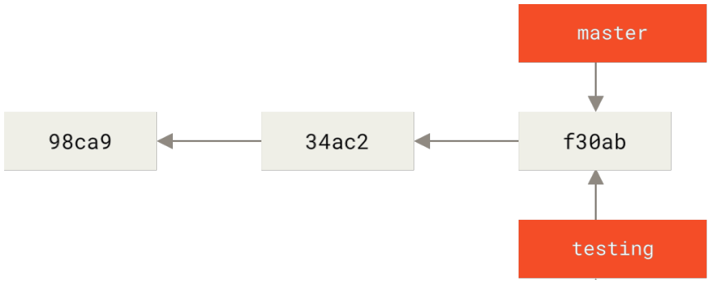
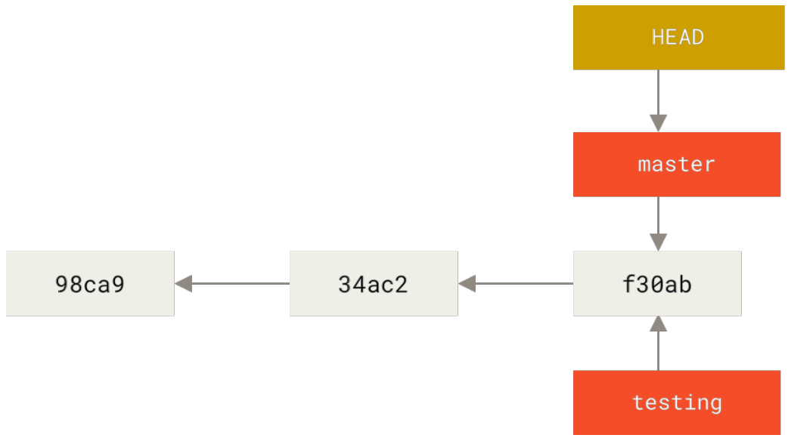
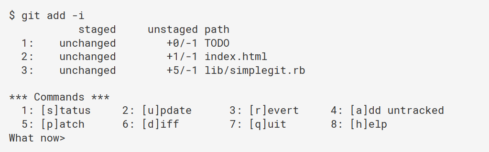
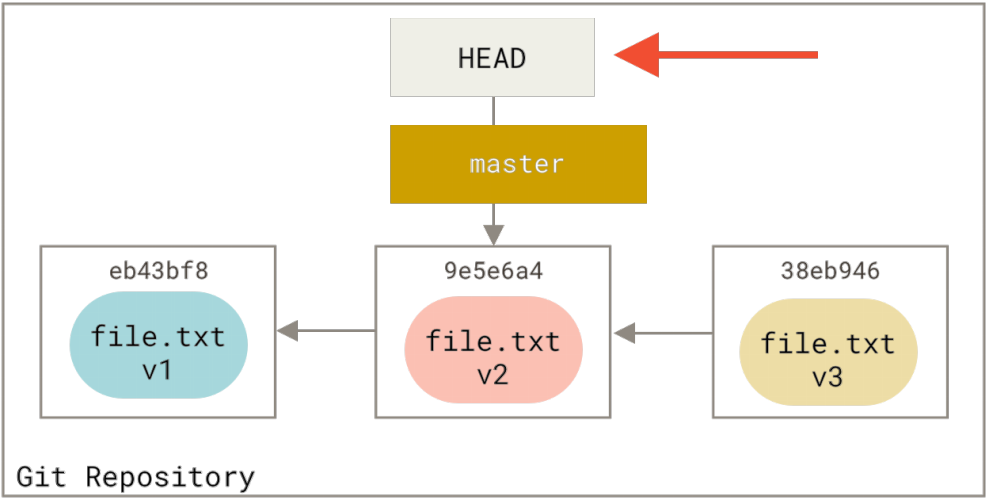
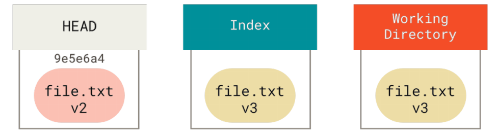
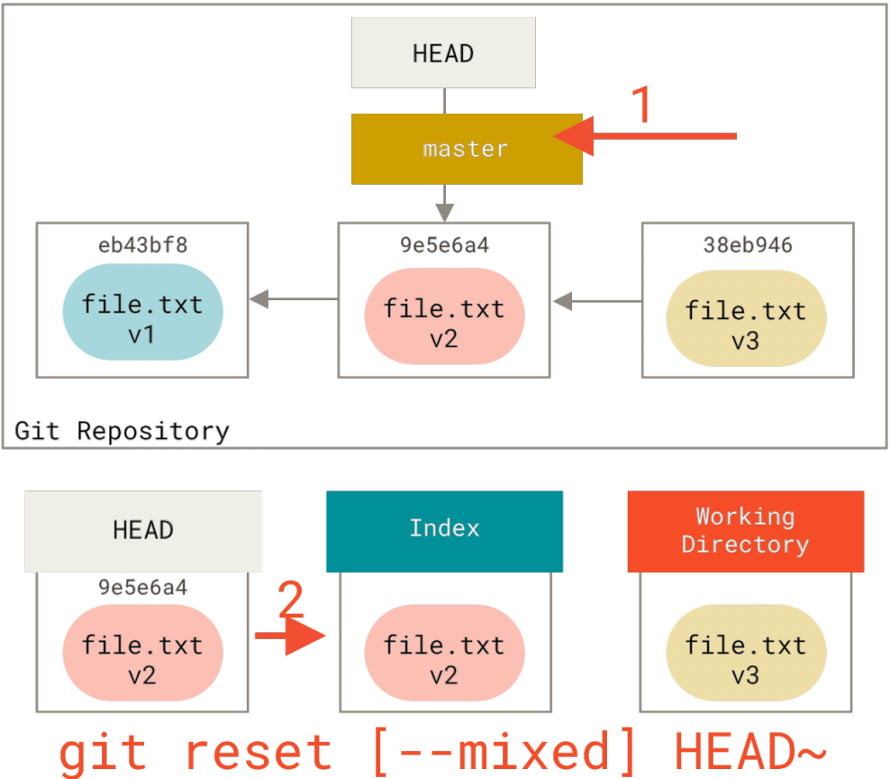
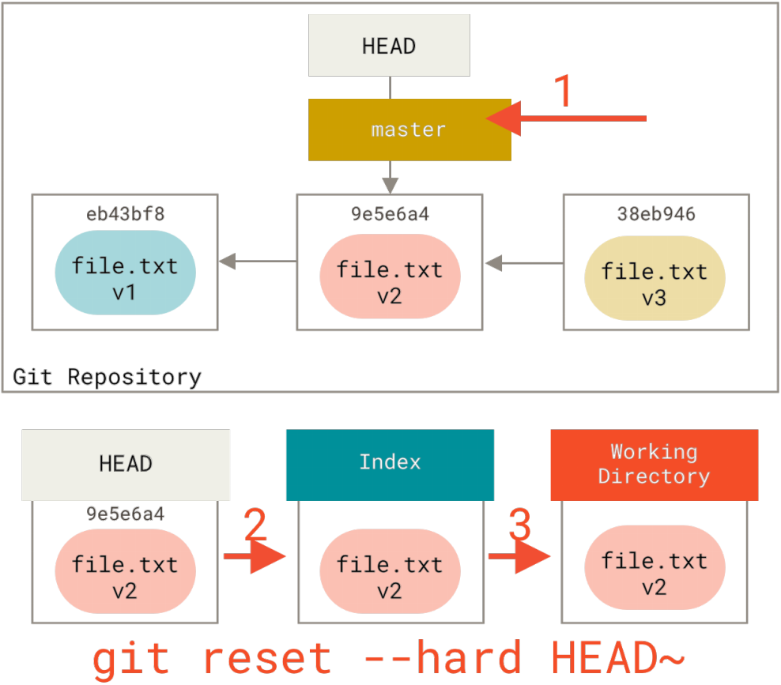

# Git 学习

Copyright (C) 2022, Milo, all rights reserved.  
Author:笨小孩(2601171627@qq.com)  
Time:2022-10-11

## 第一章 Git概述

Git是**分布式**版本控制系统。

### 1.1何为版本控制

​	记录文本内容变化，可以快速查阅特定版本修订情况的系统。最重要是记录文件修改历史。

​	版本控制工具：

（**1）集中式版本控制工具**
	CVS、SVN、VSS......
	有一个单一的集中管理的服务器，保存所有文件的修订版本，而协同工作的人们都通过客户端连到这台服务器，取出最新的文件或者提交更新。
**好处**：开发者均可以一定程度看到其他开发者的任务，而且管理者可以统一管理每个开发者的权限，并且可以在一个集中化的版本控制系统中维护本地数据。
**缺点**：中央服务器故障则会导致所有开发暂停，且无法协同工作。

**（2）分布式版本控制工具**
	Git、Mercurial、Bazaar、Dares......
	客户端把代码仓库完整地镜像下来作为本地库。这样其他协作者的文件发生故障，都可以在其他客户端的本地仓库进行恢复。因此版本控制是在本地进行的
**好处**：解决了服务器断网而无法开发的问题；每个客户端都可以有完整项目

### 1.2 工作区域

​	提交到本地库后的代码版本不可以删除，因为下一版本是基于上一版本的。

### 1.3 Git和代码托管中心

​	代码托管中心是基于网络服务器的远场代码仓库，一般称为远场库
局域网：GitLab
互联网：
<font color='lightblue'>GitHub</font>（国际区域推荐使用Github，或者虽然在中国境内，但是在代码有上国际交流的也推荐使用Github）
<font color = 'lightblue'>Gitee</font>（中国境内推荐使用Gitee，无需VPN，访问速度快）

## 第二章 Git常用命令

### 2.1 设置用户签名

签名是每个操作者的标识，每次的版本提交信息中都能够看到操作者的签名信息。
**注**：这里设置的用户签名和登录 Gitee 的账号没有任何关系，签名只是本地客户端操作者的标识

```bash
$ git config --global user.name XXX		 #设置全局用户签名
$ git config --global user.email XXX.com	 #设置全局用户签名的地址，git不会验证该邮箱是否为有效邮箱
```

验证是否设置成功，终端输入以下命令
```bash
$ cat ~/.gitconfig
```

终端输出如下
```Git
[usr]
	name = XXX
	email = xxx.com
```

###　2.2 初始化本地目录

在需要创建git的目录中打开终端，输入如下命令
```bash
$ git init
```

之后可以看到在目录中生成了一个名为 .git 的文件夹, 该文件夹含有git的设置文件和文件版本信息

### 2.3 查看目录状态

```bash
$ git status [--short|-s]
	--short|-s	简短的输出信息
```

该命令可以查看在上次提交后目录的修改情况。但 <font color='pink'>status</font> 只能给出文件的追踪状态，不能给出具体的修改信息。
利用 <font color='pink'>git diff </font>命令可以更加具体地显示文件内的行变化。

```bash
$ git diff [-staged]
```

如果不带 <font color='pink'>-staged</font> 选项，则 git 会对比当前工作目录的文件与暂存区的区别，输出尚未暂存的改动。
带上 <font color='pink'>-staged</font> 选项，则 git 对比的是暂存区内的文件与上一次提交的区别，输出的是已暂存的文件与上一次提交的改动。

**文件状态解析**

| **状态**                     |                           **描述**                           |
| :--------------------------- | :----------------------------------------------------------: |
| **已提交<br />(Commited)**   |               表示该文件已经被保存在提交对象中               |
| **已暂存<br />(Staged)**     | 表示被修改的文件已经保存在暂存区<br />使用<font color='pink'> git commit </font>命令变成 **Commited** 状态 |
| **已修改<br />(Modified)**   | 表示该文件被修改但还没有保存在暂存区<br />使用<font color='pink'> git add </font>命令变成 **Staged** 状态 |
| **未修改<br />(Unmodified)** |              表示该文件相对于上一次提交没有修改              |
| **未跟踪<br />(Untracked)**  | 表示该文件不在任何一次提交对象中，未纳入版本管理<br />可能是被 Git 忽略的文件或者开发者主动不纳入版本管理的文件 |

### 2.4 提交暂存区

将修改的文件提交到暂存区
``` bash
$ git add XXX（文件名）
$ git add .  #该命令是提交所有文件
```

**注意**：如果对文件 <font color='pink'>add</font> 操作完成后又修改了，则新修改的文件不会在暂存区，而会重新被标记为 <font color='pink'>untracked</font> 状态，暂存区保存的还是之前 <font color='pink'>add </font>的文件版本。因此每次文件修改都需要 <font color='pink'>add </font>操作确保文件的最新版本在暂存区。

### 2.5 提交本地库

把暂存区的文件提交到本地库
```bash
$ git commit -m "日志信息" [文件名]
```

文件名如果为空的话，则把暂存区的所有文件都进行提交。可以通过文件名来单独提交某个文件。

```bash
$ git commit -m -a "日志信息"
```

该命令相比上一个命令多了 <font color='pink'>-a</font> 选项，可以自动把 **已经追踪的文件** 加入暂存区并提交，可以不用<font color='pink'> git add </font>操作。

### 2.6 移除文件

文件移除分两种情况：

- 所有新提交的版本和本地工作目录中都不再需要该文件，即完全删除

- 在新提交的版本中不再需要该文件，但本地工作目录中还需要该文件。类似不小心把build、lib等调试目录提交而需要删除。

**对于第一种情况**，不可以简单地在本地目录中删除文件，因为此时暂存区还保留着该文件的快照。需要用如下命令

```bash
$ git rm XXX	删除文件
$ git rm -r XXX	删除文件夹
```

如果暂存区已经保存了修改后的文件，则需要使用强制删除选项 <font color='pink'>-f</font> 。
```bash
$ git rm -f [文件名]
```

**对于第二种情况**，在使用 <font color='pink'>rm</font> 命令时需要加上 <font color='pink'>--cached </font>选项，目的是只删除暂存区的快照。

```bash
$ git rm --cached XXX
```

### 2.7 移动文件

移动文件的同时改名并进行加入暂存区，一般可以用三行指令来完成

```bash
$ mv XXX1 XXX2
$ git rm XXX1
$ git add XXX2
```

而可以直接用 <font color='pink'>git mv </font>一行命令完成，效果是一样的
```bash
$ git mv XXX1 XXX2
```

### 2.8 查看日志

(1) 简单查看提交的版本号信息
```bash
$ git reflog
```

<font color='pink'>reflog</font> 可以查看因为版本回退而导致 commit 信息丢失的commitID。

(2) 查看详细的提交日志信息

```bash
$ git log [--option]
  options
  	--all 显示所有分支
  	--pretty=online 将提交信息显示为一行
  	        =format 可以设置输出的格式（具体使用方法如下图）
  	--abbrev-commit 使得输出的commited信息更简短
  	--graph 用图的形式显示
  	--patch|-p 显示每次提交引入的差异（用补丁的格式输出）
  	--no-merges 不包含合并的提交信息
```


**限制输出**
可以添加选项来限制 <font color='pink'>git log </font>的输出信息

```bash
$ git log [option]
```


**过滤器** 

```bash
$ git log -S XXX
```

<font color='pink'>-S </font>该选项的作用时显示那些**添加**或者**删除** xxx 字符串的提交。

### 2.9 撤销操作

#### * 2.9.1 提交撤销

**<font color='red'>注意：</font>**撤销操作有可能会造成修改内容的丢失

当 commit 时可能有某些文件没有加入暂存区或者 commit 信息写错了，此时可以利用撤销命令。
```bash
$ git commit --amend
```

如果自上一次提交后并没有做出任何修改，此时会只需要你修改提交信息，修改后的提交信息会自动覆盖上一次的信息。
如果相比上一次提交有添加、删除或者修改文件，则需要先执行 <font color='pink'>git add </font>操作将新内容暂存，之后再调用 <font color='pink'>--amend</font>
**该命令的本质是将暂存区的文件提交的同时将新的提交信息覆盖上一次的提交信息**，意味着上此提交的内容全部被覆盖，因此建议只有**小修补**时才使用该命令，如果相比上一次提交有较大改动，还是直接重新提交来避免出错。

#### * 2.9.2 撤销对文件的修改

如果对某个文件的修改内容不想保存，比如修改来修改去发现最初（上一次提交时）更适合，此时可以用此操作。
```bash
$ git checkout -- <file>
```

**注意：**该操作会把修改的内容全部覆盖，并且几乎不可复原，操作前请三思！

### 2.10 远程库的使用

如果想查看本机已经配置的远程仓库，可以用 <font color='pink'>git remote</font> 命令。指定选项 -v 则会显示需要读写远程仓库的简写和URL
```bash
$ git remote [-v]
```

#### 2.10.1 添加远场仓库

```bash
$ git remote add <shortname> <url/http>
```

**shortname** 为本地对远程库的简称，但一般都设置为 **origin** 统一来标识远程库。

## 第三章 Git分支

### 3.1 分支简介

Git 的分支本质上是指向提交对象的可变指针。Git 的默认分支名字是<font color='pink'> master </font>。<font color='pink'>master</font> 分支跟其他分支完全一样，在 <font color='pink'> git init </font>时就会创建它。

### 3.2 分支显示

查看当前项目的分支情况，输入以下命令
```bash
$ git branch
```

如果要查看每个分支的最后一次提交，加入参数 <font color='pink'>-v </font>
```bash
$ git branch -v
```

### 3.3 分支创建

在终端输入以下命令创建新分支
```bash
$ git branch <new_branch>
```

创建完成后，新分支的初始内容是原分支的某次提交内容，如下图。testing 新分支与 master 指向同一个提交内容。


利用<font color='pink'> git log </font>和加上参数选项 <font color='pink'>--decorate</font> 可以查看各个分支当前所指向得到提交对象。
```bash
$ git log --oneline --decorate
```

**显示特定分支**
git 是利用 <font color='pink'> HEAD </font>的特殊指针来实现分支的显示和转换。<font color='pink'>HEAD </font>指针指向当前所在的本地分支，从而可以查看该分支的内容。只有 <font color='pink'>HEAD </font>指针指向分支才能被显示，如下图。


### 3.4 分支切换

要切换分支的话，需要将 <font color='pink'>HEAD </font>指针指向其他分支，使用如下命令
```bash
$ git checkout <destination_branch>
```

由前面可知，分支本质上是可变指针，指向提交对象，存储的内容是**提交对象的校验和**（长度为40的SHA-1值字符串），则创建一个新分支相当于往一个文件中写入41个字节（40个字符和1个换行符），因此 Git 创建和删除分支非常快速，并不需要对原始的内容进行复制。

**创建分支同时切换去新分支**

```bash
$ git checkout -b <new_branch>
```

### * 3.5 分支合并

```bash
$ git merge (分支名)
```

**在使用此命令时需要搞清楚合并的方向**。把指定分支合并到当前分支上。即需要在目的分支的分支上操作这个指令。

- 无冲突：
  合并的分支此时所指向的提交内容是被合并分支所在提交的**直接祖先**，此时合并的分支会直接快速推进到被合并的分支。

- 合并冲突：

  合并时如果两个分支在同一个文件的同一个位置有两套完全不同的修改，则需要人为来决定新代码的内容。

```Git
<<<<<<<HEAD		
codeblocks1		#该部分为当前分支的内容
=======
codeblocks2		#该部分为被merged的分支的内容
>>>>>>>(merged branch)
```

解决完成冲突后保存，并且重新add和commit。
可以用 <font color='pink'>git status </font>来查看包含未解决冲而处于未合并（unmerged）的文件。
**注**：commit时不能带有具体的文件名
合并分支时只会修改进行merge的分支，而不会修改被merged的分支    

### 3.6 远程分支

#### 3.6.1 远程跟踪分支

远程跟踪分支是远程分支状态的引用。它们是本地**无法移动**的本地引用。该分支反映你最后一次连接远程仓库时所在的位置。它们以 <font color='pink'><remote> / <branch></font> 的形式命名。
在利用 <font color='pink'>clone </font>命令时，会在服务器拉取数据，并将远程库自动命名为 <font color='pink'>origin</font> ，同时创建一个指向拉取数据的 <font color='pink'>master </font>分支的指针，并且在本地命名为<font color='pink'> origin/master</font> ，该分支就是**远程跟踪分支**。同时 Git 也会创建一个与 <font color='pink'> origin/master </font>分支指向同一个地方的本地 <font color='pink'>master </font>分支，该分支是**跟踪分支**，这样可以在本地进行开发。如下图


此时 <font color='pink'>origin/master </font>与 <font color='pink'>master </font>分支是两个不同的分支，<font color='pink'>master </font>分支可以进行提交，此时<font color='pink'>master </font>分支会与<font color='pink'>origin/master </font>分支进行分叉。如果要与远程仓库同步数据，运行如下命令
```bash
$ git fetch <remote>
```

#### 3.6.2 推送 push

将本地分支的内容显式地推送到远程库的分支，使用如下命令
```bash
$ git push <remote> <branch>
```

同时也可以作为第一次提交分支的操作，在远程库创建分支。

可以推送本地特定分支到远程库的特定分支

```bash
$ git push <remote> <local_branch>:<remote_branch>
```

#### 3.6.3 创建跟踪分支

跟踪分支是本地分支。跟踪分支与远程分支直接关联。
如果其他开发者在远程库创建了新分支，此时如果你 <font color='pink'>git fetch </font>抓取远程库数据时，会在本地创建 <font color='pink'>origin/<new_branch> </font>的分支，且不可修改，不会创建对应的本地 <font color='pink'><new_branch> </font>分支。此时可以运行 <font color='pink'>git merge origin/<branch> </font>来将远程分支的内容合并到当前所在分支。
如果想在本地创建一个新的分支来接收远程分支的数据，可以使用如下命令

```bash
$ git checkout -b <local_branch> origin/<branch>
```

该命令可以创建一个本地**跟踪分支**，并且工作起点位于 <font color='pink'>origin/<branch></font> 分支。

也可以用 <font color='pink'>--track </font>的快捷方式
```bash
$ git checkout --track origin/<branch>
```

该命令会自动在本地创建与远程分支名字相同的本地**跟踪分支**。

同时还有更加便捷的方式
```bash
$ git checkout <branch>
```

如果要 <font color='pink'>checkout </font>出的分支在本地是不存在，且远程库中刚好**只有一个**名字与之匹配的远程分支，则便会创建一个与之对应的**跟踪分支**。

**上游快捷方式**
当设置好跟踪分支后，可以用简写 <font color='pink'>@{upstream} / @{u} </font>来引用它的上游分支。

#### 3.6.4 查看跟踪分支

可以使用 <font color='pink'>git branch </font>的 <font color='pink'>-vv </font>参数来查看设置的所有跟踪分支。可以看到本地每一个分支正在跟踪哪个远程分支以及本地分支是否领先、落后或是**都有**。
```bash
$ git branch -vv
```

**注：**远程分支领先本地分支是指远程分支有一次新的提交但本地分支没有合并；本地分支领先远程分支是指本地分支有新的提交没有推送。因此**领先与落后可以同时发生**。

#### * 3.6.5 拉取 pull

使用 <font color='pink'>git fetch </font>命令时只会从服务器中抓取本地没有的数据并更新 <font color='pink'>origin/<branch> </font>的指针指向最新的提交，但不会修改工作目录的内容，即不会改变本地分支。如果在获取数据的同时合并到本地分支，可以用如下命令
```bash
$ git pull
```

该命令可以理解为 <font color='pink'>git fecth </font>和紧接着一个 <font color='pink'>git merge </font>。<font color='pink'>pull </font>的结果可以分为以下两种情况

- 当前本地跟踪分支是远程分支的某次旧提交，即本地跟踪分支所在版本是远程分支版本的直接祖先，此时 <font color='pink'>pull </font>的结果是本地跟踪分支直接快速推进到远程分支的最新提交而不会有冲突。

- 当前本地跟踪分支的版本不是远程分支版本的直接祖先，即分支出现了分叉，此时 <font color='pink'>pull </font>会出现合并冲突，需要人为进行冲突解决。

#### 3.6.6 删除远程分支

在删除远程分支前，需要确保远程分支已经被 merge 了**至少一次**，否则是没办法删除远程分支的。可以在 <font color='pink'>push </font>的同时删除远程分支。
```bash
$ git push <remote> --delete <branch>
```

**注**：这样的操作只是让 Git 服务器删除指向分支的指针，该分支的提交内容并没有马上删除。

### 3.7 变基

整合分支最容易的方法是 <font color='pink'>merge </font>命令，它会把两个分支的最新快照以及两者最近的共同祖先进行三方合并，合并的结果是生成一个新的快照（并提交）。

还可以通过**变基**的方法来实现：在分支的当前提交上提取相对于**共同祖先**的补丁和修改，然后在另外分支要合并的提交上应用一次。即将提交到某一分支上的所有修改都移至另一条分支上。
假设要将 <font color='pink'>issue </font>分支变基到 <font color='pink'>master </font>分支上，可以这样操作

```bash
$ git checkout issue	#切换到issue分支
$ git rebase master		#变基到master分支
```

或者一行命令完成
```bash
$ git rebase <basebranch> <topicbranch>
```

basebranch为基分支，topicbranch为要变基的分支。

变基的原理：如下图，首先找到两个分支的**最近共同祖先** <font color='pink'>C2 </font>，然后对比当前分支相对于该祖先的历次提交，提取相应的修改并存为**临时文件**，然后将当前分支指向**目标基底** <font color='pink'>C3 </font>，最后以此将之前另存为临时文件的修改程序应用。


之后可以回到 <font color='pink'>master </font>分支进行一次快速合并推进
```bash
$ git checkout master
$ git merge experiment
```

此时<font color='pink'> master </font>分支会快速推进到 <font color='pink'> C4' </font>版本。并且 <font color='pink'>C4' </font>版本与直接 <font color='pink'>merge </font>得到的版本是一样的。

**变基的好处**
可以看到变基可以让分支转移到其他分支上，这样便可以保留分支的同时使得提交历史更加简洁，减少分支的分叉。

同时变基可以将生成的“重放”放在其他分支上，但前提是该分支与参与变基的两个分支有共同祖先。在使用 <font color='pink'>git rebase </font>时添加 <font color='pink'>--onto </font>参数进行操作。

```bash
$ git rebase --onto <branch1> <branch2> <branch3>
```

该命令意思：取出 <font color='pink'>branch3 </font>分支，找出它从 <font color='pink'>branch2 </font>分支分歧之后的补丁，然后把这些补丁放在 <font color='pink'>branch1 </font>分支上重放一遍。

<font color='red'><u>变基的准则：</u></font>如果你已经将本地的 <font color='pink'>commit </font>在远程分支进行了<font color='pink'>push </font>，而别人已经将新的内容 <font color='pink'>pull </font>到本地并进行开发，此时不要执行变基。
因为变基后会丢失变基的分支的提交信息，此时别人的开发内容便会失去基础，但别人本地上提交内容还是存在的，因此当他 <font color='pink'>push </font>到远程分支时，远程分支之前因为变基消失的提交版本又会恢复。

同时在<font color='pink'> pull </font>时说明了如果远程库的数据与本地目录的提交内容有冲突时，需要强制执行<font color='pink'> merge </font>来解决冲突并进行 <font color='pink'>commit </font>。其实也可以在 <font color='pink'>pull </font>的同时执行变基操作。

```bash
$ git pull --rebase
```

## 第四章 Git 工具

### 4.1 选择修订版本

#### 4.1.1 输出简短且唯一的 SHA-1

每个提交对象都有唯一的SHA-1值，但完整的 SHA-1 值过长，不方便引用。在使用 <font color='pink'>git log </font>命令时可以加上参数 <font color='pink'>--abbrev-commit </font>查看每次提交的最简短且唯一的 SHA-1 值。

```bash
$ git log --abbrev-commit
```

#### 4.1.2 分支引用

可以用分支名来代替该分支的最新一次提交。假设 <font color='pink'>issue </font>分支指向的最新提交是 <font color='pink'>ca82a6d... </font>，则以下两个命令是等价的。

```bash
$ git show ca82a6dff817ec66f44342007202690a93763949
$ git show issue
```

#### 4.1.3 引用日志

Git 会在后台保留一个引用日志（reflog），该日志记录了最近几个月本地的 HEAD 和分支引用所指向的提交历史。每当本地 HEAD 指向的位置发生变化，Git 就会将这个信息存储下来，用如下命令来查看引用日志。
```bash
$ git reflog
```

如果想查看 HEAD 前n次所指向的提交，可以使用 <font color='pink'>@{n} </font>来获得指定数据。
```bash
$ git show HEAD@{n}
```

引用日志只存在于本地仓库，它只是一个记录在**自己**的仓库里操作的日志，每个人的本地仓库的引用日志是不同的。

#### 4.1.4 祖先引用

如果在引用的尾部加上一个 <font color='pink'>^ </font>，Git 会解析为该引用的上一个提交。与 <font color='pink'>^ </font>同义的是 <font color='pink'>~ </font>。
如果要表示前几次的提交，则需要标识为 <font color='pink'>^^.... </font>或者 <font color='pink'>~~... </font>或者 <font color='pink'>~n </font>（n 代表数字）。

#### 4.1.5 交互式暂存

在运行 <font color='pink'>git add </font>时使用 <font color='pink'>-i </font>或者 <font color='pink'>--interactive </font>选项，可以进入交互式终端模式。显示类似下面的东西：


#### 4.1.6 暂存补丁

假如对一个文件多处进行了修改，然后只想要暂存其中的某几个修改，可以在运行 <font color='pink'> git add </font>命令时使用 <font color='pink'>-p </font>或者 <font color='pink'>--patch </font>来启动一个 Git 脚本来部分暂存文件。

### 4.2 贮藏与清理

假如遇到如下情况：当对项目进行了一段时间工作后，所有东西好像都混乱了，此时你想要切换到另一个分支做点事情，但问题是不想把现在没完成的工作进行提交，因此也不想暂存起来<font  color='red'>（那为什么不直接add呢？）</font>。此种情况可以使用 <font color='pink'>git stash push </font>命令。

```bash
$ git stash push [options]
    options:
    	--include-untracked|-u	贮藏任何未追踪的文件，除了在 .gitignore 里明确忽略的文件
    	--all|-a	贮藏所有文件，包括忽略的文件
    	--patch		交互式贮藏
```


何为贮藏（stash）：跟踪当前工作目录文件的修改与暂存的改动，然后将未完成的修改**保存到一个栈上**，而你可以在任何时候重新应用这些改动（甚至在不同的分支上）。

要查看贮藏的东西，可以使用 <font color='pink'>git stash list </font>命令。

要重新应用一个贮藏，可以使用 <font color='pink'>git stash apply stash@{n} </font>（n 为贮藏的序号）如果不指定一个贮藏，Git 会默认指定为最近的贮藏。
**需要注意的是**，当应用贮藏时，Git 会重新修改了贮藏里的文件，但文件内部的内容并没有改变，意味着需要重新对贮藏的文件进行暂存。

### 4.3 搜索

#### 4.3.1 Git grep

Git 内部提供了 <font color='pink'>grep </font>命令，可以从提交历史、工作目录中查找一个字符串或者正则表达式。<font color='pink'>grep</font> 默认情况下会查找工作目录下的文件。
```bash
$ git grep [options]
    options:
    --line-number|-n	输出 Git 找到的匹配行的行号
    --count|-c		输出仅包括那些包含匹配字符串的文件，以及包含了多少个匹配
    --show-function|-p		输出显示每一个匹配的字符串所在的方法或函数
    --and		可以查看复杂的字符串组合
```

#### 4.3.2 Git 日志搜索

使用情况：想知道**某些内容**什么时候存在或者引入。在 <font color='pink'>git log </font>中加入参数选项来使用。
```bash
$ git log [options]
    options:
    -S {字符串}	显示新增或删除该字符串的提交
    -L :{字符串}:{文件名}		在特定文件中找出该字符串创建之后一系列变更对应得补丁。该字符串如果是函数名的话，可以显示函数的修改变化。字符串也可以用正则表达式。
    
```

### 4.4 重置揭秘

#### 4.4.1 三棵树

对于 Git ，这里的“树”的实际意思是“文件的集合”，而不是特定的数据结构。

| **树**            | **用途**                             |
| ----------------- | ------------------------------------ |
| HEAD              | 上一次提交的快照，下一次提交的父节点 |
| Index             | 预期的下一次提交的快照               |
| Working Directory | 沙盒                                 |

**HEAD**
HEAD 是**当前分支引用的指针**，总是指向该分支上的最后一次提交。这表明 HEAD 将是下一次提交的父节点。理解 HEAD 最简单的方式，就是将它看做 **该分支上的最后一次提交** 的快照。

**Index（索引）**
索引是你**预期的下一次提交**。就是 Git 的“暂存区”的概念。
Git 会将上一次检出到工作目录的所有文件填充到索引区。之后可能会将其中一些文件替换为新版本，然后通过 <font color='pink'>git commit </font>将它们作为新的提交。

**Working Directory（工作目录）**
HEAD 和 Index的内容存储在 <font color='pink'>.git </font>的文件夹中，然后工作目录会将它们解包为实际的文件以便编辑。在将修改提交到暂存区并记录到历史之前，可以随意更改工作目录的内容。

**工作流程**
下图展示了HEAD、Index和Working Directory的关系

#### 4.4.2 重置（reset）的作用

在一个情景中演示 <font color='pink'>reset </font>的命令。
假设有一个文件 <font color='pink'>file.txt </font>修改了三次并进行了提交，现在的提交历史是这样的：


当运行 <font color='pink'>reset </font>命令时，会做三个基本操作。

**第一步：移动 HEAD**
<font color='pink'>reset </font>做的第一件事情就是移动 HEAD 的指向。这与改变 HEAD 自身不同（<font color='pink'>checkout </font>做的只是改变 HEAD 的自身指向）；<font color='pink'> reset </font>移动的是 HEAD 所指向的分支。意味着如果此时 HEAD 指向 <font color='pink'>master </font>分支，运行 <font color='pink'>git reset 9e5e6a4 </font>将会使得  <font color='pink'>matser </font>指向 <font color='pink'>9e5e6a4 </font>。

无论使用何种形式的<font color='pink'> reset </font>，第一步都会执行。如果使用 <font color='pink'>reset --soft </font>，则它将停留在第一步。
此时HEAD、Index 和 Working Directory如下图：


因此第一步本质上是撤销了上一次 <font color='pink'>git commit </font>命令，把分支移动回了原来的位置，而不会改变索引和工作目录，即回到了<font color='pink'> git commit </font>命令执行之前。现在可以修改工作区文件后用<font color='pink'> git add </font>来更新索引并再次运行<font color='pink'> git commit </font>来完成提交，相当于使用了<font color='pink'> git commit --amend </font>。

**第二步：更新索引（--mixed）**
第二步，<font color='pink'>reset </font>会用 HEAD 指向的当前快照的内容来**更新索引**，如下图：


此时相当于撤销上一次**提交**的同时，还会**取消暂存**所有东西。回到了<font color='pink'> git add </font>和<font color='pink'> git commit </font>的命令执行之前。
如果指定了<font color='pink'> --mixed </font>选项，此时<font color='pink'> reset </font>将会在第二步停止。而且这也是<font color='pink'> reset </font>的默认行为，即不指定任何选项时就只停止在第二步。

**第三步：更新工作目录（--hard）**

如果指定了 <font color='pink'> --hard </font>选项，则<font color='pink'> reset </font>会执行第三步，要做的事情是将 HEAD 指向的快照来更新工作区，如下图：


相当于撤销了最后的提交、<font color='pink'> git add </font>和<font color='pink'> git commit </font>命令以及**工作目录中所有的修改工作**。
**<font color='red'>注意！</font>** 使用<font color='pink'> --hard </font>选项是 <font color='pink'>reset </font>命令唯一的危险用法。如果你本地的修改没有提交，<font color='pink'> --hard </font>选项会强制覆盖工作目录的文件，从而导致修改无法恢复，因为 Git 中没有该修改的记录。

**总结**
<font color='pink'>reset </font>命令会以特定顺序重写这三棵树，在你指定以下选项时停止：

1. 移动 **HEAD** 指向的分支（*若指定了 <font color='pink'>--soft </font>选项，则到此停止*）
2. 将 **HEAD** 指向的新的快照来更新 **Index** （*默认行为，若未指定 <font color='pink'>--hard </font>选项，则到此结束*）
3. 更新工作区域，将 **HEAD** 指向的新的快照内容强制覆盖当前工作目录的内容（*指定了<font color='pink'> --hard </font>选项*）

#### 4.4.3 检出（checkout）

运行<font color='pink'> git checkout [branch] </font>与运行<font color='pink'> git reset --hard [branch] </font>非常类似，它也会更新 HEAD、Index 和 Working Directory的内容，不过有两点区别。

1. <font color='pink'>checkout </font>对工作目录是安全的，它会通过检查来确保不会将**已更改**的文件弄丢。同时它还会在工作目录中先试着简单合并一下，这样所有**还未修改过**的文件都会被更新。而<font color='pink'> reset --hard </font>则会不做检查就全面替换所有东西。
2. <font color='pink'>checkout </font>只会移动(修改) HEAD 自身来指向另一个分支，原本指向的分支引用不会改变。而<font color='pink'> reset </font>会移动 HEAD 分支的指向。

**总结**

下表给出了 <font color='pink'>reset </font>和 <font color='pink'> checkout </font>之间对于 HEAD、Index 和 Working Directory作用的区别。“HEAD” 一列中的 “REF” 表示该命令移动了 HEAD 指向的分支引用，而 “HEAD” 则表示只移动了 HEAD 自身。特别注意 *WD Safe？*一列，如果标记为**NO**，则代表该命令有数据丢失的风险。

|                                                 | **HEAD** | **Index** | **Workdir** | **WD Safe?** |
| ----------------------------------------------- | -------- | --------- | ----------- | ------------ |
| <font color='pink'>reset --soft [commit]</font> | REF      | NO        | NO          | YES          |
| <font color='pink'>reset [commit]</font>        | REF      | YES       | NO          | YES          |
| <font color='pink'>reset --hard [commit]</font> | REF      | YES       | YES         | **NO**       |
| <font color='pink'>checkout [commit]</font>     | HEAD     | YES       | YES         | YES          |


## 其他资料

