# CMake入门

## 1、 简介

### 1.1、CMake是什么

CMake是一个跨平台的安装（编译）工具，可以用简单而统一的语句来描述所有平台的安装(编译)过程。  

### 1.2、为什么要使用CMake  

假设你现在有一份名为 main.cpp 的源文件，你想将他编译生成一个名为 main 的可执行文件，可以打开终端，输入：

```shell
g++ -o main main.cpp
```

那如果你的程序包括了许多份源文件，再使用上述的命令就会显得繁琐复杂，更何况这些源文件之间可能还存在一些依赖关系。  
这时候可以使用 make 工具 —— make 工具类似于批处理工具，可以对多个源文件进行批量地编译和链接；但其本身不具备编译和批处理功能，它是通过调用 makefile 文件中的命令实现编译和链接。  
makefile 文件中的命令中就包含了调用 g++（也可以是别的编译器）去编译某个源文件的命令。  
但当工程非常庞大时，手动编写 makefile 文件也是非常麻烦的过程，且跨平台使用时 makefile 需要重新修改。  
所以才要使用 CMake ，CMake 使我们可以用简单的命令按照自己的意愿去设置工程中各种源文件、包的依赖关系和编译顺序。  
**注意：CMake 是将我们所写的 CMakeLists.txt 文件转化生成 makefile 文件，最终还需要通过 make 工具调用 makefile 来实现项目的编译**  

## 2、CMake最基本命令

### 2.1、cmake_minimum_required

```cmake
cmake_minimum_required(VERSION 3.0.2)
```  

该命令指定了编译工程的最低 CMake 版本，须放在根目录 CMakeLists.txt 的**第一行**。  
**VERSION 后的 x.x.x 不能超过当前安装的 CMake 版本。当前安装的 CMake 版本可以通过命令行输入以下命令查看：**

```shell
cmake --version
```  

### 2.2、project

```cmake
project(2024_week2)
```  

该命令指定了项目工程的名字。在调用该命令的同时，一些 CMake 自带的变量会被赋值，例如：  

```cmake
PROJECT_NAME
PROJECT_SOURCE_DIR
PROJECT_BINARY_DIR
```  

这些变量具体的含义和用处会在后文提到。  
**注意：project 命令并非必不可少，如果没有调用 project 命令，cmake 仍然会生成一个默认的工程名“Project”，以及工程名对应的变量。但还是建议使用自己设置的项目名。**  

### 2.3、add_executable

```cmake
add_executable(<name> [source1] [source2] ...)
```  

该命令用于指定将哪些源文件编译成可执行文件，其中第一个参数是可执行文件的名称，后面的参数为用于构建该可执行文件的所有源文件（如有多个用空格隔开即可）。  
**不需要写 .h 文件和 .hpp 文件**  

## 3、CMake最基本框架  

### 3.1、CMakeLists.txt 的基本语法和结构  

在编写CMakeLists.txt时，**指令不区分大小写，但参数变量区分大小写。**

有了上述的三个命令，我们就可以编写一个最简单的 CMakeLists.txt。  

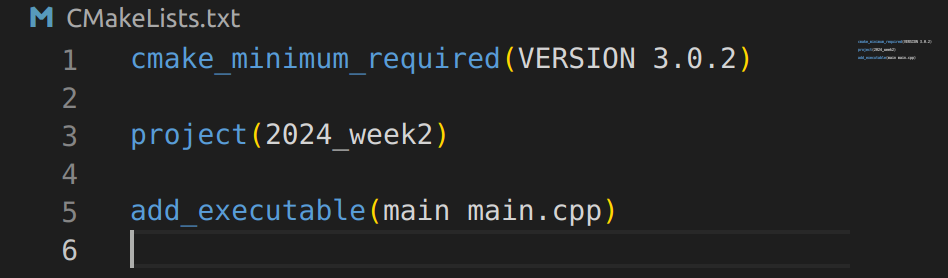  

### 3.2、编译过程  

在 CMakeLists.txt 和 main.cpp 所在的目录下打开终端，输入：  

```shell
mkdir build
cd build
cmake ..
make
```  

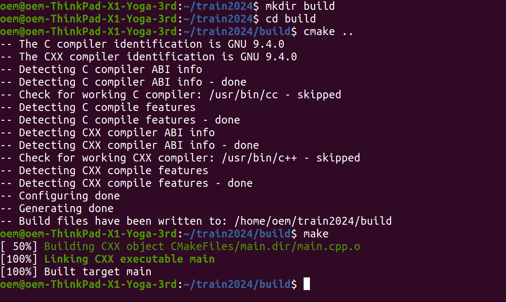  

就完成了项目编译，进入 build 文件夹，可以看到 CMake 生成的 makefile 文件和编译生成的可执行文件（及一些其他的中间文件）：  

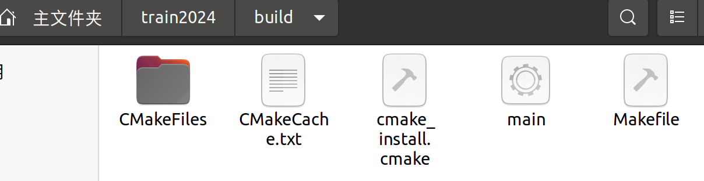  

## 4、CMake进阶  

### 4.1、引用头文件  

在写工程代码的过程中，一定会涉及到头文件的引用。这时也需要在 CMakeLists.txt 中添加对应的内容,需要使用以下函数：  

```cmake
include_directories([dir1] [dir2] ...)
```  

该函数用于设置头文件所在路径，一般需要将项目中所有头文件的路径作为参数写入（多个参数用空格隔开）：自己编写的头文件建议统一放入 include 文件夹中，而各种库的头文件可以调用 CMake 自带的接口变量得到其头文件路径。  

例：  
现有如下的目录结构：  

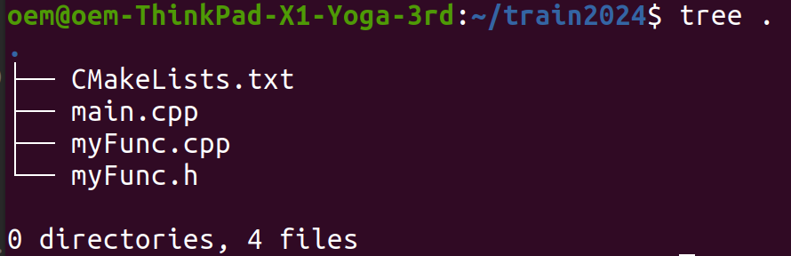  

希望将 main.cpp 编译成名为 main 的可执行文件，且 main.cpp 中调用了 myFunc.h 中的函数。对应的 CMakeLists.txt 如下：  

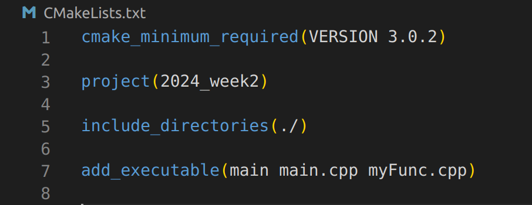  

然后打开终端输入上述的命令编译即可。  
**注意：添加头文件后一定记得将对应的源文件作为参数写入 add_executable 中，否在会报未定义的错。**  

### 4.2、库的使用  

库文件的链接需要用到以下函数：  

```cmake
target_link_libraries(<name> [lib1] [lib2] ...)
```  

该函数用在 add_executable 之后，第一个参数是可执行文件的名字，后面的参数是所有需要链接的库名称(多个参数用空格隔开)

#### 4.2.1、自己编写的库  

需要自己编写库的情况一般是开发一些新传感器（雷达、相机）的驱动，需要用到以下函数：  

```cmake
add_library(<name> [STATIC | SHARED | MODULE] [source1] [source2] ...)
```  

第一个参数是库的名称，第二个可选参数代表编译成库的类型（静态库 | 动态库 | 模块库）（具体区别及相关内容可自学），后面的参数是编译该库需要的所有源文件（多个参数用空格隔开）。  
**编译成库的源文件可以不写入 add_executable() 的参数中，但库文件要在 target_link_libraries() 中链接**  

例：  

仍然是4.1的情况，现在将 myFunc.cpp 编译成库文件，再链接至 main 。对应的 CMakeLists.txt 如下：  

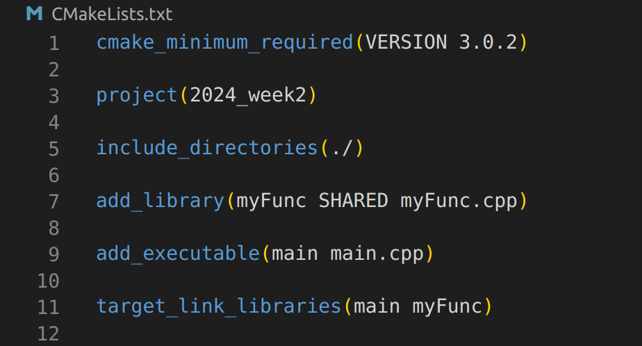  

然后打开终端输入上述的命令编译即可。在编译完成后进入 build/ 文件夹，可以看到生成了对应的库文件：

  

生成的库文件名字格式为：lib + 库名（add_library第一个参数）+ 后缀（与库的的类型有关，”.so“就是动态库的后缀）  

#### 4.2.2、调用外部库  

调用外部库和自己编译的库文件基本原理是相同的，只要把外部库的头文件位置写入 include_directories() ，再把库名写入 target_link_libraries()即可。  

但这并不代表我们要去寻找这些库的库文件名称和头文件路径，可以用以下函数简化这个过程：

```cmake
find_package(<package> [version] [EXACT] [QUIET] [MODULE]
             [REQUIRED] [[COMPONENTS] [components...]])
# 仅列出部分可选参数
```  

通过 find_package() 可以顺利查找任何符合 cmake package 标准的外部工程，包括 boost，opencv，pcl，eigen 等。其第一个参数代表查找的库的名称，后面是一些可选项，比如：[QUIET] 参数指代，当查找出错时屏蔽 message() 的输出；[REQUIRED] 参数指代，当找不到 package 时终止过程。  

现用 XXX 代表需要查找的库的名称。以下命令

```cmake
find_package(XXX,REQUIRED)
```  

会设置一系列变量，包括：

```cmake
XXX_FOUND        # 代表库是否查找成功
XXX_INCLUDE_DIRS # 代表头文件的路径
XXX_LIBRARIES    # 代表库文件的名称
```  

以上的变量引用后可以直接作为参数写入上述的两个函数中。

例：

链接 OpenCV 至可执行文件的 CMakeLists.txt 如下：

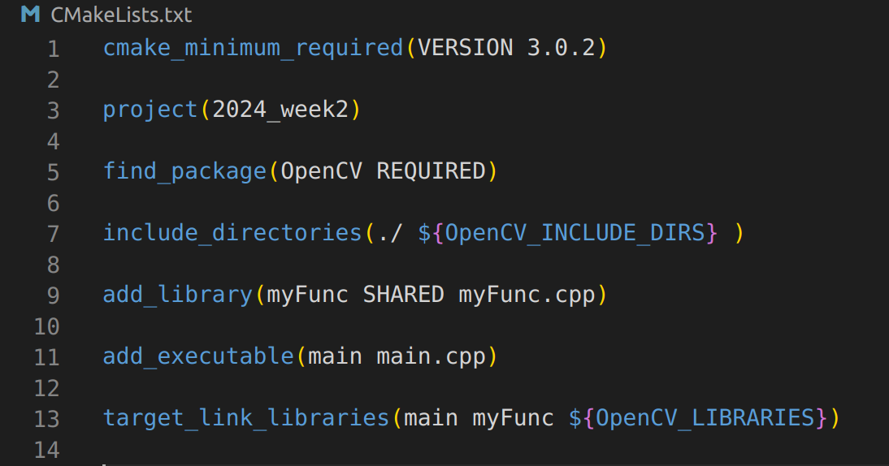  

后按照前述步骤编译即可。  
**调用外部库的步骤：find —— include —— link，即找包——头文件——链接库，记住这个过程就记住了三个函数**  

### 4.3、调试相关  

CMake 作为一种语言，同样具有条件、循环等语句，同样可以设置变量，可以输出信息。  

#### 4.3.1、**变量**

变量是 CMake 语言的最基本的存储单元。变量的值始终为**字符串类型**，尽管一些命令将会将其理解为其他类型的值。命令set()用于显式地设置一个变量:  

```cmake
set(<variable> <value>...)
```  

**variable** 指代变量的名字，而 **value** 则是赋给该变量的值。CMake 中的变量是**区分大小写**的。  

需要注意的是，**set()** 命令不仅可以设置自定义的变量，也能对 **CMake 自带的变量**进行赋值，例如：  

```cmake
LIBRARY_OUTPUT_PATH      # 库文件输出路径
EXECUTABLE_OUTPUT_PATH   # 可执行文件输出路径
CMAKE_INCLUDE_PATH       # 头文件搜索路径
CMAKE_LIBRARY_PATH       # 库文件搜索路径
CMAKE_BUILD_TYPE         # 项目构建类型 RELEASE | DEBUG
CMAKE_C_COMPILER         # C编译器，可以设置优化选项
CMAKE_CXX_COMPILER       # C++编译器，同上
......
```  

访问一个变量 variable 的值，需要用 **${variable}** 的格式。

#### 4.3.2、**条件语句**

CMake 中的条件语句遵循以下的格式：

```cmake
if(<condition>)
  <commands>
elseif(<condition>) # 可选块，可重复出现
  <commands>
else()              # 可选块
  <commands>
endif()
```  

**注意：if 括号中的 condition 中的变量不需要加 ${}。**

#### 4.3.3、**信息输出**

CMake 中的 message() 命令可以打印指定的内容：

```cmake
message([<mode>] "message text" ...)
```  

可选的 mode 关键字表示该信息的类型，以下列出几种取值：

```cmake
FATAL_ERROR    # CMake Error,停止处理和生成
WARNING        # CMake Warning,继续处理
STATUS         # project用户可能感兴趣的主要信息
```  

再往后的参数是输出内容，**可以是双引号括住的字符串，也可以是一个变量的 ${} 。**

例：打印头文件包含路径

```cmake
message(STATUS ${CMAKE_INCLUDE_PATH})
```

#### 4.3.4、**综合应用**  

有了上述的三种手段，就可以进行一些简单的输出调试。  
比如通过简单的输出信息来判断 CMake 是否执行到某处，下面是一个简单的例子：判断 OpenCV 库是否被找到。

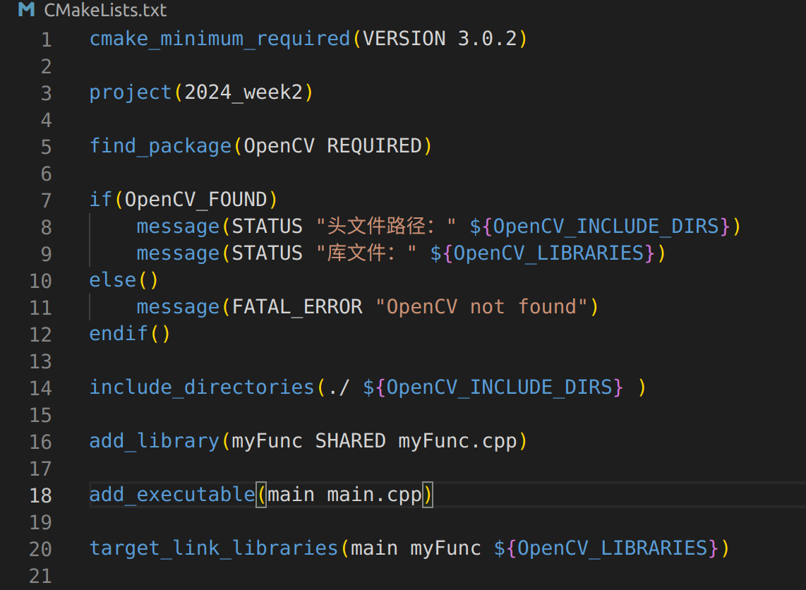  

执行 cmake 后，可以看到终端打印的消息：

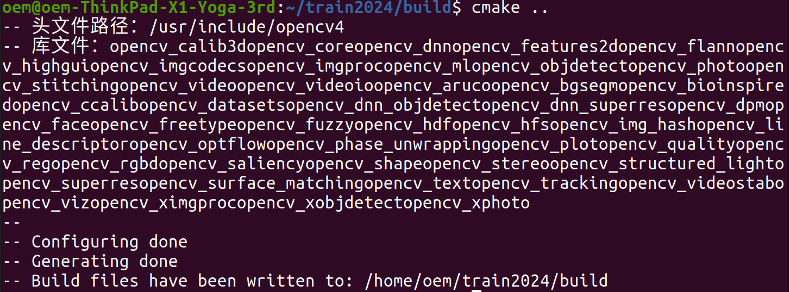  

## 5、工程代码结构  

为了便于管理和增加代码工程的可读性，建议工程代码遵循一定的规范，包括但不限于：  
(1)、自己编写的头文件统一放至 include/ 文件夹中；  
(2)、不包含 main 函数的源文件统一放至 src/ 文件夹中；  
(3)、可执行文件存放至 bin/ 文件夹中；  
(4)、一部分在工程中比较独立的模块（比如串口通信和驱动等）可以将其头文件和源文件单独放在一文件夹中，编译成库文件；  
(5)、库文件存放至 lib/ 文件夹中；

简单地作一个示范：  

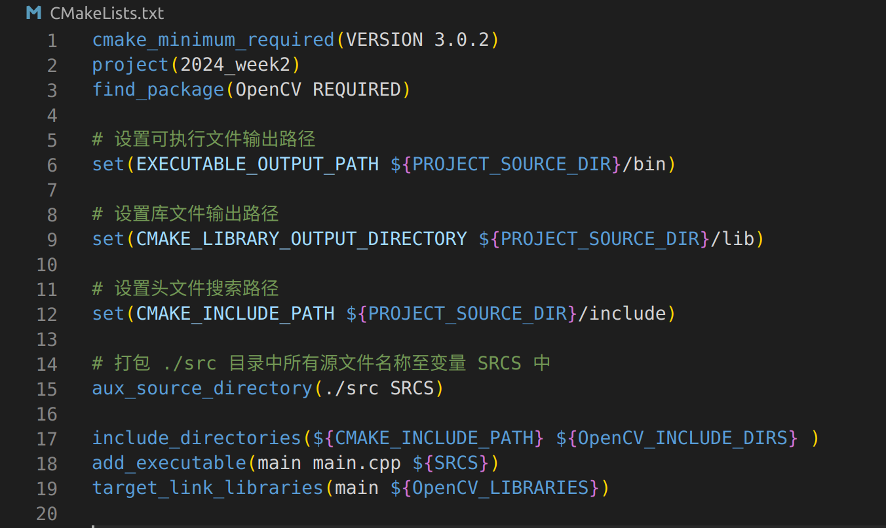  

执行 cmake 命令后，可以看到如下的目录：

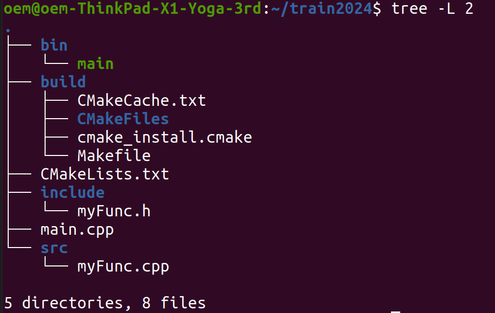  

可见各种文件的位置清晰明了。由于 CMakeLists.txt 中并没有将任何源文件编译成库，所以目录中没有 lib/ 文件夹，否则产生的库文件会存放在 lib/ 下。  

对于规范中的第四条，可以使用命令：

```cmake
add_subdirectory()
```  

来将子文件夹的编译加入编译任务列表中，**该子目录中必须也有一个 CMakeLists.txt 来指导本目录内文件的编译。**  

下面用一个名为 protocol 的库作一个简单的示范：  

在上一个示范的 CMakeLists.txt 中加入一句：

```cmake
add_subdirectory(./protocol)
```  

而 protocol 子文件夹中的 CMakeLists.txt 如下：

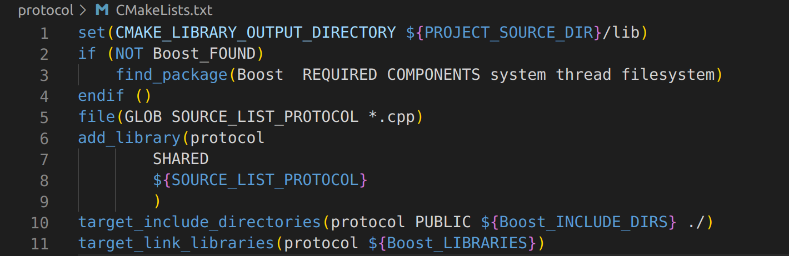  

可以得知要把该文件夹中的内容编译为一个名为 protocol 的库。  

编译完成后，工程目录如下图：  

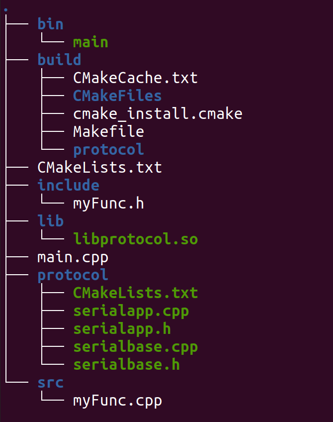  

以上就是一个工程的基本框架。  

## 6、报错查询指南  

CMakeLists.txt 中的代码错误会导致许多不同的报错，这些报错有的发生在构建 makefile 时（即运行 cmake .. 命令时），有时发生在编译时（即运行 make 命令时），给入门者带来了许多困惑与不便。以下介绍几种初学 CMake 时常见的报错与其对应的修正方法。  

### 6.1、编译阶段发生的错误

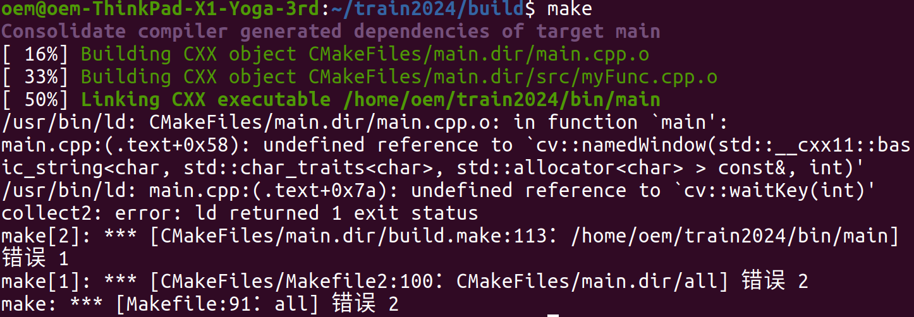

外部库的函数报错，诸如 **undefined reference** 一类（如上图）：请检查外部库的头文件路径是否包含在 **include_directories()** 函数中，是否在生成可执行文件后链接了其库文件。

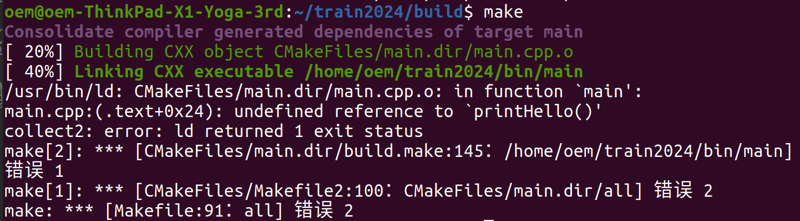  

自己写的函数报错，诸如 **undefined reference** 一类（如上图）：若含有该函数实现的源文件被编译成库，清检查是否在生成可执行文件后链接了该库文件；若含有该函数实现的源文件没有被编译成库，请检查该源文件是否加入了 **add_executable()** 中。  

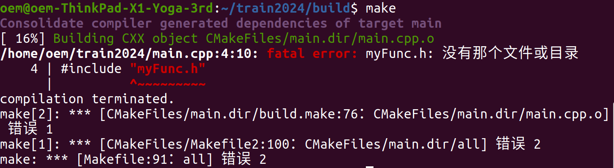  

报错为找不到文件，请检查报错的头文件是否存在，若存在其路径是否在 **include_directories()** 中。

### 6.2、构建 makefile 时发生的错误  

目前来说如果在构建 makefile 时就发生了错误，一般有两种情况：第一种是误用了不了解的函数，这种情况建议百度搜索，如果还无法解决可以在群里提问；另一种是不慎写错某些变量或函数的名称，例如：

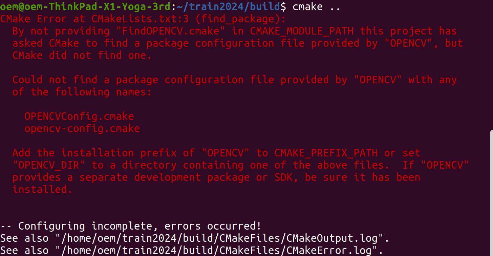  

这是由于在 **find_package()** 命令中将 **OpenCV** 误敲为 **OPENCV** 导致找不到包。

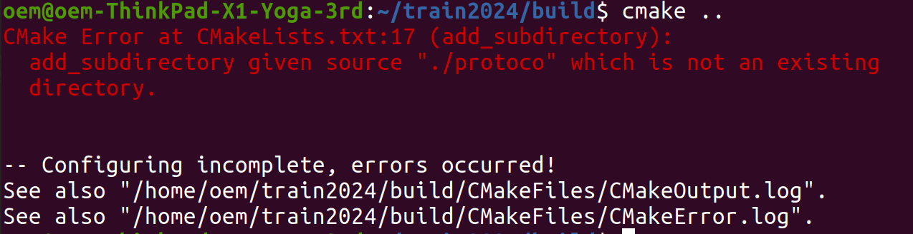  

这是由于在 **add_subdirectory()** 中敲错了子目录的名字所导致。  

这些报错都有详细的英文解释，仔细阅读或者用翻译软件翻译都可以轻松地找出错误原因并加以修正。

**本文档仅对 CMake 的各种用法作简单的介绍，即使将文档中的内容完全掌握，也不过是对 CMake 这个强大的工具初窥门径。前路漫漫，还须砥行。**
