# C++性能优化

Copyright (C) 2024, HITCRT_VISION, all rights reserved.  
Author: Elaine(3431754748@qq.com)  
Time: 2023-7-30
____

## 1.C++性能优化综述
### 1.1为什么要进行程序性能优化？
由于机器人设备运行配置有限，而比赛中程序对精度和速度的追求是无限的，因此如何在有限的设备资源上让程序运行速度更快，利用硬件资源的效率更高，是无法绕过的一大问题。     

例如，假设机器人运动速度为1m/s,倘若需要机器人定位精度达到3cm以内，则需机器人程序运行帧率达到30帧以上。如果需要机器人速度更快或达到更高的定位精度，则程序帧率仍需要进一步提升。这就需要我们掌握充足的程序优化技巧和代码规范能力，让我们的程序速度更快，运行更稳健。

## 2.C++程序性能分析工具
### 2.1 查看CPU运行状态
使用命令
```shell
gnome-system-monitor
```
查看ubuntu下的资源管理器；
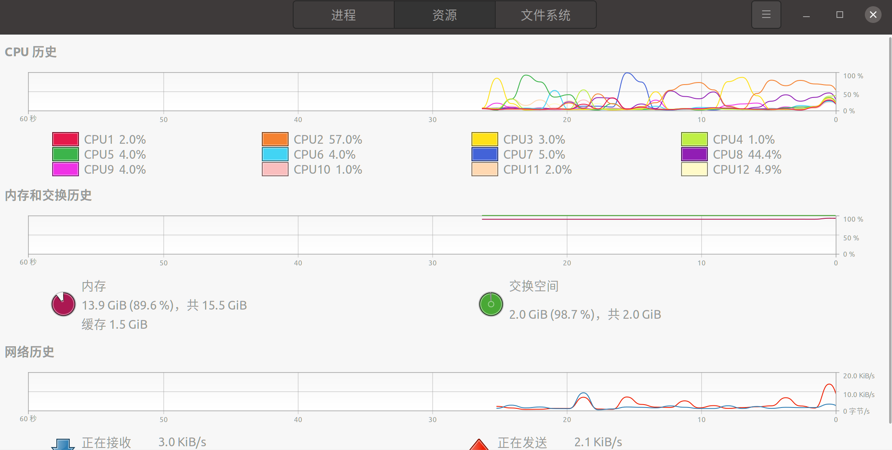
使用命令
```shell
top
```
查看当前cpu使用情况
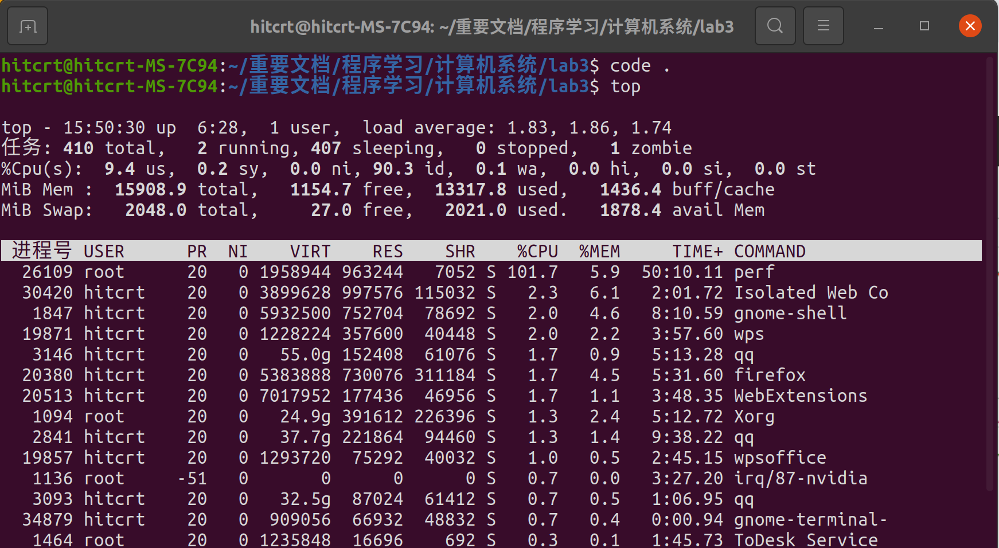
```shell
free -h
```
查看当前内存使用情况
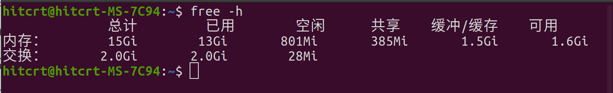
### 2.2 埋点法查看函数运行时间
顾名思义，埋点法就是在函数运行前记录一次当前时间，函数结束后再记录一次当前时间，两者相减即为该函数所运行的时间。下面为一封装好的帧率计算函数：
```c++
/**
 * @brief 计算帧率
 * @author Elaine and Wind (3431754748@qq.com)
 */
class calFPS {
   private:
    struct timeval time_t;
    double time1, time2;
    double temptime1 = 0,temptime2 = 0;
    double totalFPS = 0;
    int timecomp = 0;

   public:
   /**
    * @brief Construct a new cal F P S object
    * @author Elaine and Wind (3431754748@qq.com)
    */
    calFPS() {
        gettimeofday(&time_t, NULL);
        time1 = time_t.tv_sec * 1e3 + time_t.tv_usec * 1e-3;
    }
    /**
     * @brief 计算开始时间
     * @author Elaine and Wind (3431754748@qq.com)
     */
    void computeFPS() { 
        gettimeofday(&time_t, NULL); 
        time2 = time_t.tv_sec * 1e3 + time_t.tv_usec * 1e-3;
        temptime1 = time2;}
    /**
     * @brief 显示总帧率
     * @author Elaine and Wind (3431754748@qq.com)
     */
    void show() {
        std::cout << "total COST TIME: " << time2 - time1 << std::endl;
        float nowFPS = 1000.0 / (time2 - time1);
        totalFPS += nowFPS;
        timecomp++;
        float averageFPS = totalFPS / timecomp;
        std::cout << "fps:" << nowFPS << "   averageFPS:" << averageFPS << std::endl;  // 计算帧率
        time1 = time2;
    }
};
```
将其在需要计算帧率的函数前后“埋点”，即可得到所需计算函数的帧率及运行时间。
```c++
    calFPS FPS;
    for(int i = 0; i < 10000; i++)
    {
        FPS.computeFPS();
        imageSmoothing(img);
        FPS.show();
    }
```
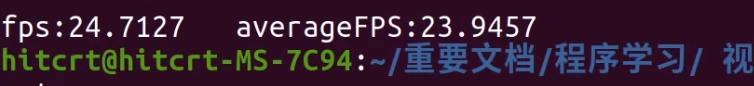

### 2.3 perf性能分析工具
#### 2.3.1 perf综述
+ Perf是内置于Linux内核源码树中的性能剖析(profiling)工具。它基于事件采样原理，以性能事件为基础，支持针对处理器相关性能指标与操作系统相关性能指标的性能剖析。常用于性能瓶颈的查找与热点代码的定位。
  
+ 通过它，应用程序可以利用 PMU，tracepoint 和内核中的特殊计数器来进行性能统计。
  
+ 使用 perf可以分析程序运行期间发生的硬件事件，比如 cache miss等；也可以分析软件事件，比如 page fault 和进程切换
#### 2.3.2 perf安装
ubuntu可使用下列命令安装：
```shell
sudo apt install linux-tools-common -y
```
安装成功后可使用下列命令查看perf帮助。
```shell
perf --help
```
使用下列命令查看CPU程序运行状态及资源占用情况
```shell
perf top -a
```
运行截图如下图所示：
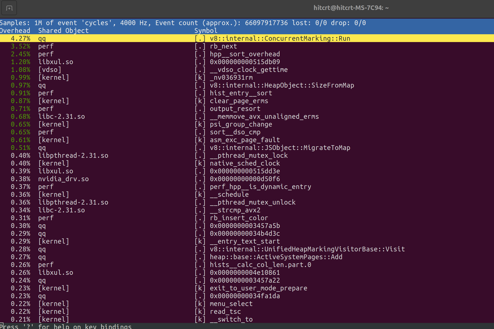

#### 2.3.3 perf跟踪进程
运行可执行文件**picnorm**，并利用**ps -h**命令抓取进程id为28674
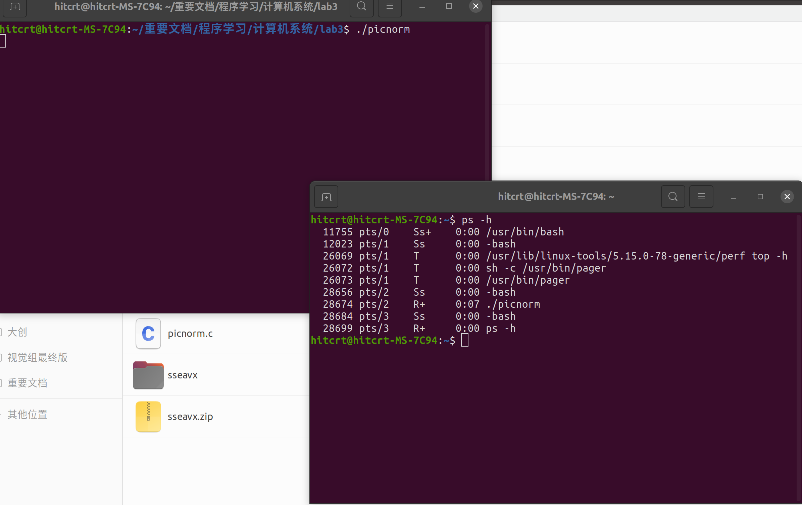
利用下列指令分析程序，并获得分析文件**perf.data** 。
```shell
perf record -F 99 -p 28674 -g -- sleep 30
```
其中
+ record表示记录
+ -F 99表示每秒99次
+ -p 13204是进程号，即对哪个进程进行分析
+ -g表示记录调用栈，sleep 30则是持续30秒

运行结果如下：
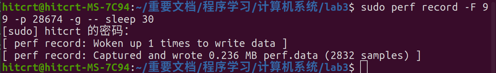

#### 2.3.4绘制进程火焰图
**火焰图简介：** 火焰图（Flame Graph）以一个全局的视野来看待程序运行的时间分布，它从底部往顶部列出所有可能的调用栈及其运行时间。    
**火焰图含义：** 

+ y 轴表示调用栈, 每一层都是一个函数. 调用栈越深, 火焰就越高, 顶部就是正在执行的函数, 下方都是它的父函数。
  
+ x 轴表示抽样数, 如果一个函数在 x 轴占据的宽度越宽, 就表示它被抽到的次数多, 即执行的时间长. 注意, x 轴不代表时间, 而是所有的调用栈合并后, 按字母顺序排列的。
  
+ 因此，如果一个程序形成的火焰图“山顶”越宽，“山顶”之间的间隔越大，程序越有可能出现性能问题。
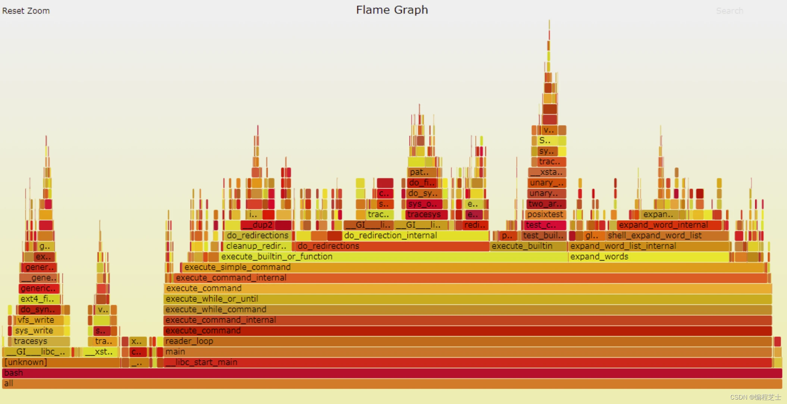

**生成火焰图的实例：**    
在刚才生成perf.data的基础上，我们继续进行：
+ 1.登录网站[FlameGraph](https://gitcode.net/mirrors/brendangregg/FlameGraph)，并下载用于火焰图绘制的压缩包，解压到相应文件夹内。    
+ 2.用perf script工具解析perf.data:
```shell
perf script > out.perf
```
+ 3.折叠调用栈(用到FlameGraph中的stackcollapse-perf.pl文件)：
```shell
./FlameGraph-master/stackcollapse-perf.pl out.perf > out.folded
```
+ 4.生成火焰图（用到FlameGraph中的flamegraph.pl文件）：
```shell
./FlameGraph-master/flamegraph.pl out.folded > perf.svg
```
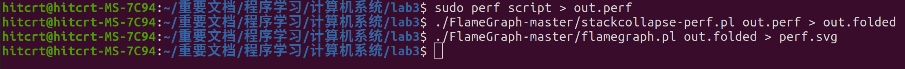
生成的火焰图5如下所示，提示该程序并未充分利用CPU资源，仍有优化空间。
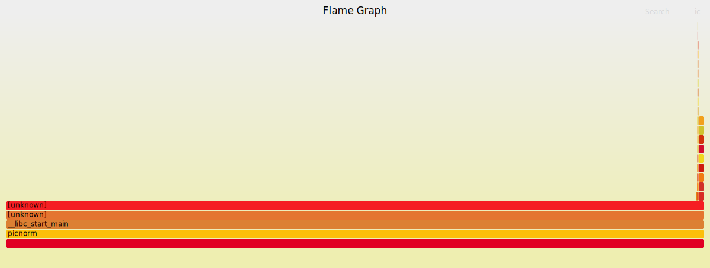

## 3.C++性能优化方法
### 3.1多线程优化
**openmp加速**    
在进行**for**循环运算时,若循环所需时间较长,可使用**openmp**对循环进行多线程加速。   
openmp运行原理是为每次循环创建一个线程，线程执行完成后再将各线程所得结果相加。因此要求使用openmp时每次循环之间最好独立。   
使用openmp加速循环的用法非常简单。    
+ 首先导入openmp库：
```c++
#include "omp.h"
```
+ 其次在需要用到openmp执行多线程的循环前加上
```c++
#pragma omp parallel for num_threads(12)//将循环分为12个线程
```
其中num_threads括号中的数字即为创建的线程数量，可根据自身电脑内核数量进行设置。    
下面为对图像平滑算法函数执行1000次for循环,并采用openmp优化的程序：
```c++
    double startTimeVal8 = omp_get_wtime();
    {
        #pragma omp parallel for num_threads(12)//将循环分为12个线程
        for(int i = 0; i < 1000; i++)
        {
            imageSmoothing(img);
        }
    }
    double finishTimeVal8 = omp_get_wtime();
    printf("多线程优化 执行1000次用时: %f 秒\n", (double)(finishTimeVal8 - startTimeVal8));
```
使用gcc编译时，应注意开启openmp优化选项：
```shell
    gcc -o picnorm.c -fopenmp
```
最终结果显示，使用openmp加速所需时间远低于不使用openmp加速所需时间。
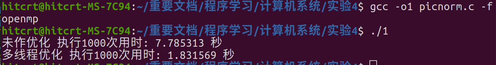

### 3.2面向编译器的优化
**gcc**在编译时会尝试对程序进行多方面优化。
+ **O0** 选项不进行任何优化，在这种情况下，编译器尽量的缩短编译消耗（时间，空间），此时，debug 会产出和程序预期的结果。当程序运行被断点打断，此时程序内的各种声明是独立的，我们可以任意的给变量赋值，或者在函数体内把程序计数器指到其他语句,以及从源程序中 精确地获取你期待的结果。

+ **O1** 优化会消耗少多的编译时间，它主要对代码的分支，常量以及表达式等进行优化。

+ **O2** 会尝试更多的寄存器级的优化以及指令级的优化，它会在编译期间占用更多的内存和编译时间。

+ **O3** 在 O2 的基础上进行更多的优化，例如使用伪寄存器网络，普通函数的内联，以及针对循环的更多优化。

+ **Os** 主要是对代码大小的优化，我们基本不用做更多的关心。 

如采用**O3**优化编译picnorm.c源文件：
```shell
    gcc -O3 picnorm.c -fopenmp
```
输出结果如下图所示，可见程序执行所需时间降为不做编译器优化时的二分之一。
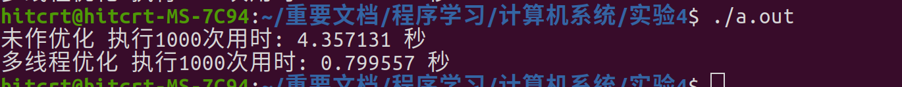

需注意：通常各种编译器优化都会打乱程序的结构和执行顺序，让调试工作变得无从着手。因此我们应在确认代码调试稳定后再启用编译器优化。由于编译器优化会改动程序本身运行流程，**因此想要成功执行编译器优化，需要程序具有良好的代码规范**，否则编译器会因为“认不出”相关变量而报错。

此外，在CMakelists中，我们可以使用以下命令设置优化模式为release:
```CMake
set(CMAKE_BUILD_TYPE release)
```
### 3.3面向Cache的优化
计算机中有寄存器，L1，L2，L3级缓存（Cache）,计算机首先从内存中取出数据送入L3缓存，然后再从L3缓存中取出数据送入L2缓存，最后从L2缓存送入L1缓存，再送入寄存器进行运算。 **每次送入的数据大小相当于相应的缓存大小。** 因此在较大数据（如图像）处理时，若将数据做合适的分块，使**每一块数据大小正好是缓存区大小** ，则可降低数据从内存载入缓存的时间，从而降低程序运行时间。    
以刚才运行的图像平滑程序为例：
```c++
void imageSmoothing(int** img)
{
    for(int j = 1; j < 1920; j++)
    {
        for (int i = 1; i < 1080; i++)
        {
            img[i][j] = (img[i-1][j] + img[i+1][j]+img[i][j-1] + img[i][j+1] ) / 4; 
            //取某个像素周围四个点的平均值
        }
    }
}
```
已知CPU L1，L2，L3级Cache为**32MB，3MB，192KB**：

+ 图像数据大小为1920 * 1080 * 8 = 15.8MB,对于L3来说可以放下整个图像数据，因此对于L3来说我们无需对数据进行分块。	  

+ 而L2的大小为3MB，因此图像数据无法整个放入L2中，需要对其进行分块处理。15.8/3=5，因此我们对图像分成八个大组，每个大组约为2MB，可以整个放入L2缓存中。     

+ L1的大小为192KB，因此L2中的组数据需要重新分组才能放入L1。3MB/192KB=16，因此我们将L2中的每个大组分成16个小组，此时每个小组有15行，每行1080列，15*1080 * 8 < 192kb,因此每个小组可以直接放入L1缓存中。
  
优化后代码如下：
```c++
void imageSmoothing_CacheOptimize(int **img) //面向Cache的优化（分块处理）
{
                               //三级缓存32MB：1080*1920*8=16588800, 16588800/1024/1024=15.82MB，故无需分块
    for (int i = 0; i < 8; i++)//二级缓存3MB：15.82MB/3MB=5，故将原数据分成8块。
    {
        for (int j = 0; j < 16; j++)//一级缓存192kb，3MB/192kb=16，故再分成16块
        {
            int L2block = i * 240; //L2block有1920/8=240行
            int L1block = j * 15;        //L1block有240/16=15行
            for (int colPtr = 1; colPtr <= 15; colPtr ++) //实时指向每一级的指针
            {
                int nowCol = colPtr + L1block + L2block; //当前行的读数
                if (nowCol == 1919)break;
                for (int k = 1; k < 1080; k++)  //列的读数
                {
                    img[nowCol][k] = (img[nowCol-1][k] + img[nowCol+1][k]+img[nowCol][k-1] + img[nowCol][k+1] ) / 4; 
                }
            }
        }
    }
}
```


### 3.4面向CPU的优化
在循环中可使用循环展开，这样可以减少循环边界检查，同时将程序改写为CPU流水线易于执行的方式。如3.3所示的图像平滑程序可展开如下：
```c++
void imageSmoothing(int** img)
{
    for(int j = 1; j < 1920; j++)
    {
        for (int j = 1; j < 1080; j += 6) //CPU内核数为6，将一次循环展开为6次提高程序性能
        {
            lastj = pixLastColumn[j];
            nextj = pixNextColumn[j];
            img[i][j] = (lastj + nextj+pixThisColumn[j-1] + pixThisColumn[j+1] ) >> 2; 
            img[i][j + 1] = (lastj + nextj+pixThisColumn[j] + pixThisColumn[j+2] ) >> 2; 
            img[i][j + 2] = (lastj + nextj+pixThisColumn[j+1] + pixThisColumn[j+3] ) >> 2;  
            img[i][j + 3] = (lastj + nextj+pixThisColumn[j+2] + pixThisColumn[j+4] ) >> 2; 
            img[i][j + 4] = (lastj + nextj+pixThisColumn[j+3] + pixThisColumn[j+5] ) >> 2;  
            img[i][j + 5] = (lastj + nextj+pixThisColumn[j+4] + pixThisColumn[j+6] ) >> 2; 
            //取某个像素周围四个点的平均值
        }
    }
}
```
 
### 3.5其他程序优化思路
**复杂运算简化**
+ 使用时间开销较小的左移、右移代替时间开销较大的乘法或者除法
如：
```c++
int b = a / 16;
int b = a >> 4;
```
+ 使用循环内局部变量代替循环外全局变量（循环外全局变量一般存储在内存中，循环内局部变量存储在寄存器中，寄存器的计算开销远小于内存的计算开销）
```c++
void combine1(vec_ptr v, data_t *dest){
long int i;
*dest = IDENT;
  for (i= 0; i< vec_length(v); i++) {
  data_t val; //使用循环内局部变量val储存运算结果
  get_vec_element(v, i, &val);
  *dest = *dest OP val;
  }
}
```
+ 减少循环中重复使用，产生相同结果的语句。如：
```c++
void set_row(double *a, double *b,
long i, long n)
{
long j;
for (j = 0; j < n; j++)
a[n*i+j] = b[j]; //每次都计算n*i,重复且无用
}
```
修改为
```c++
long j;
int ni = n*i;//将n*i移出循环
for (j = 0; j < n; j++)
    a[ni+j] = b[j];
```
  
**分支预测**
+ 程序运行if函数时，会直接选择系统认为概率最大的一条分支，若执行出错时再返回执行另一条分支。因此分支预测失败时会产生时间消耗。
+ 可以使用三目运算语句（a > b ? c : d）或switch-case语句代替简单的if-else语句，减少分支预测失败所需的时间。

