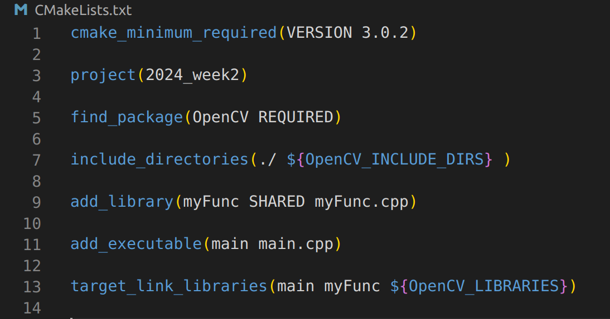
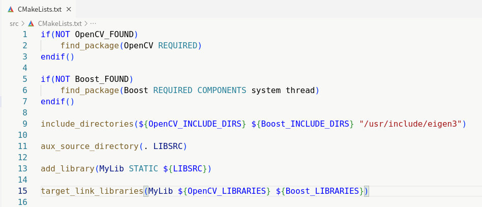
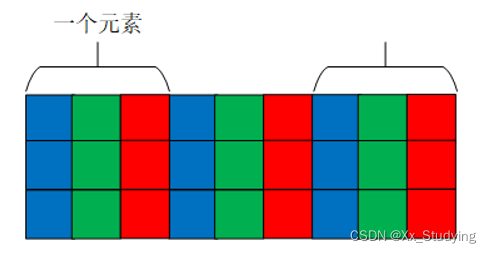

# OpenCV入门——第一章

## 1、 简介

### 1.1、OpenCV是什么

Opencv（Open Source Computer Vision Library,开源计算机视觉库）是一个基于开源发行的跨平台计算机视觉库，它实现了图像处理和计算机视觉方面的很多通用算法，已成为计算机视觉领域最有力的研究工具。

### 1.2、为什么要使用OpenCV  

OpenCV目前最为广泛使用的开源计算机视觉库，目前OpenCV4版本已将原本比较复杂的计算机视觉算法封装，并提供类似于matlab图像处理的接口，例如：

```c++
	cv::imshow("输出显示图像",img);
```
仅仅一行代码就可以将数字图像可视化，为我们编程带来极大便利。除此之外，OpenCV对大部分常见图像处理算法进行了封装，以使编程能力较基础的初学者也可以快速上手OpenCV。
**注意：CMake 是将我们所写的 CMakeLists.txt 文件转化生成 makefile 文件，最终还需要通过 make 工具调用 makefile 来实现项目的编译**  

## 2、如何在你的C++代码中使用OpenCV

### 2.1、安装OpenCV
**如果仍然没有完成Ubuntu环境配置，请在群中提问或者私聊指导答疑**
**如果已经按照第一节课内容完成环境安装，请跳过2.1节**

#### 2.1.1、apt-get install安装OpenCV(推荐)

开始之前请按照第一周课程内容或更换ubuntu默认软件源，否则下载速度会很慢，如已更换可跳过。
随便打开一个终端，输入：

```shell
sudo apt-get update
sudo apt-get install libopencv-dev
```  

等待5分钟左右完成安装。
此方法安装OpenCV版本是固定的：
Ubuntu20安装的版本为4.2.0
Ubuuntu22安装的版本为4.5.4
这两个版本完全够用，没有必要更换其他版本。

#### 2.1.2、编译安装OpenCV(不推荐)
编译安装OpenCV，不推荐，因为步骤繁琐且有失败概率
如果你还是要编译安装OpenCV，参考如下文档：
**[编译安装OpenCV教程](https://blog.csdn.net/weixin_48476701/article/details/118877144)**

### 2.2、在C++中使用OpenCV

参考第二周cmake入门4.2.2节

调用外部库和自己编译的库文件基本原理是相同的，只要把外部库的头文件位置写入 include_directories() ，再把库名写入 target_link_libraries()即可。  

通过 find_package() 可以顺利查找任何符合 cmake package 标准的外部工程，包括 OpenCV。其第一个参数代表查找的库的名称，[REQUIRED] 参数指：当找不到 package 时终止过程。  

现用 XXX 代表需要查找的库的名称。以下命令

```cmake
find_package(OpenCV,REQUIRED)
```  

同时会设置一系列变量，包括：

```cmake
XXX_FOUND        # 代表库是否查找成功
XXX_INCLUDE_DIRS # 代表头文件的路径
XXX_LIBRARIES    # 代表库文件的名称
```  

以上的变量引用后可以直接作为参数写入上述的两个函数中。


后按照前述步骤编译即可。  
**调用外部库的步骤：find —— include —— link，即找包——头文件——链接库，记住这个过程就记住了三个函数**  
这样，就在CMake中成功链接到了OpenCV

#### 2.2.1、例程：生成可执行文件时时使用OpenCV

链接 OpenCV 至可执行文件的 CMakeLists.txt 如下：

  
#### 2.2.2、例程：生成链接库时使用OpenCV

链接 OpenCV 至链接库的 CMakeLists.txt 如下：

```cmake
if(NOT OpenCV_FOUND)
    find_package(OpenCV REQUIRED)
endif()

if(NOT Boost_FOUND)
    find_package(Boost REQUIRED COMPONENTS system thread)
endif()

include_directories(${OpenCV_INCLUDE_DIRS} ${Boost_INCLUDE_DIRS} "/usr/include/eigen3")

aux_source_directory(. LIBSRC)

add_library(MyLib STATIC ${LIBSRC})

target_link_libraries(MyLib ${OpenCV_LIBRARIES} ${Boost_LIBRARIES})
```  
  
### 2.3、add_executable

```cmake
add_executable(<name> [source1] [source2] ...)
```  
具体例程见example文件夹

## 3、OpenCV命名空间
c++命名空间可以防止大规模代码中变量/函数名重复，OpenCV主要使用命名空间"cv"。
使用方法为在使用OpenCV内置函数、内置常量、内置对象时，在前面添加cv::，例如：
```c++
cv::imshow("演示输出图像", image);//推荐
cv::Mat image;
```
也可以在头文件声明后使用：但是这样就失去了命名空间的意义，所以不推荐使用。
```c++
using namespace cv;//不推荐
```
## 4、OpenCV数据结构
OpenCV涉及数据结构主要有:
```cmake
Mat  //存储矩阵，例如数字图像等
Point  //存储点Mat 
```  
### 3.1、Mat 
OpenCv提供了Mat类用来存储矩阵类型数据，包括向量、矩阵、图像等数据。一个Mat对象分为分为**矩阵头**和**指向存储数据的矩阵指针**两部分。矩阵头包含矩阵的尺寸、存储方法、地址和引用次数。矩阵头是一个常数，绝大数情况下，矩阵头的大小远小于矩阵数据量的大小。
**由于数字图像所占存储比较大，直接进行复制，创建，清空等操作比较繁琐，因此Mat数据结构中矩阵数据是被指针指向的数据**
#### 3.1.1、Mat类构造方法
默认构造函数：
```c++
cv::Mat image;
```
拷贝构造函数：
```c++
cv::Mat image(image2);
```
#### 3.1.2、Mat类赋值方法
枚举法赋值，一般用于矩阵计算，如下创建一个3*3int类型的矩阵，并将使用所有的参数逐行赋值：
```c++
cv::Mat a= (cv::Mat_<int>(3,3)<<1,2,3,4,5,6,7,8,9);
```
构造时赋值：
```c++
cv::Mat a(2, 2, CV_8UC3, cv::Scalar(0, 0, 255));//创建一个2*2大小的3通道矩阵，每个像素都是0，0，255
```
使用类方法赋值：
```c++
cv::Mat d = cv::Mat::ones(3, 3, CV_8UC1);//cv::Mat::ones，生成全1矩阵
```
浅拷贝赋值（不复制指针指向的矩阵，对复制得到的Mat进行数据修改操作**会**影响到被复制cv::Mat对象的数据）
```c++
cv::Mat a;
cv::Mat b = cv::imread("1.jpg");
a = b;
cv::Mat c = b;
```
深拷贝赋值（复制指针指向的矩阵与指针本身，相当于复制得到另一个完全独立的cv::Mat对象，对复制得到的Mat进行数据修改操作**不会**影响到被复制cv::Mat对象的数据）：
```c++
cv::Mat a;
cv::Mat b = cv::imread("1.jpg");
//两种深拷贝方式，任选其一即可
a = b.clone();  //a的数据是b的拷贝值
b.copyTo(a);    //将b拷贝到a中
```
#### 3.1.3、Mat类支持的运算
加减乘除：
```c++
cv::Mat a = (cv::Mat_<int>(3, 3) << 1, 2, 3, 4, 5, 6, 7, 8, 9);
cv::Mat b = (cv::Mat_<int>(3, 3) << 1, 2, 3, 4, 5, 6, 7, 8, 9);
cv::Mat c = (cv::Mat_<double>(3, 3) << 1.0, 2.0, 3.0, 4.0,5.0, 6.0, 7.0, 8.0, 9.0);
cv::Mat d = (cv::Mat_<double>(3, 3) << 1.0, 2.0, 3.0, 4.0, 5.0, 6.0, 7.0, 8.0, 9.0);
cv::Mat e, f, g, h,i;
e = a + b;
f = c - d;
//数乘，数除
g = 2 * a;
h = d / 2.0;
i = a - 1;
```
两个Mat类矩阵的乘法运算：
```c++
cv::Mat a = (cv::Mat_<int>(3, 3) << 1, 2, 3, 4, 5, 6, 7, 8, 9);
cv::Mat b = (cv::Mat_<int>(3, 3) << 1, 2, 3, 4, 5, 6, 7, 8, 9);
cv::Mat c = (cv::Mat_<double>(3, 3) << 1.0, 2.0, 3.0, 4.0, 5.0, 6.0, 7.0, 8.0, 9.0);
cv::Mat d = (cv::Mat_<double>(3, 3) << 1.0, 2.0, 3.0, 4.0, 5.0, 6.0, 7.0, 8.0, 9.0);
cv::Mat e, f;
double k;
e = c*d;//数学乘积
k = a.dot(b);//内积
f=a.mul(b)//对应位乘积
```
#### 3.1.3、访问Mat中数据
首先来了解一下cv::Mat是怎么存储的。
cv::Mat中像素点的数据类型比较多，但是有规律可循，如：
```c++
CV_8UC3 
```
8U表示uchar数据类型，C3表示有三个通道值，其余各种数据类型均符合此规律。例如：
```c++
CV_16UC1 
CV_8UC1
CV_32FC3
...
```
一般而言，读取得到的RGB图像为CV_8UC3,计算得到的灰度图与二值图像为CV_8UC1
每一个像素点cv::Mat的矩阵按行存储，像素通道大于1时，像素点按照数组形式存储，三通道存储示意图如下：
 
访问cv::Mat元素的接口也有两种，分别为at()与指针访问。
##### 3.1.3.1、at()函数
at()函数可进行**读取操作(无法赋值)**。at()函数直接访问矩阵中的字节，所以需要事先确定矩阵的数据类型，填写到<>当中，(i,j)表示提取像素所在坐标。
**需特别注意，i是像素点所在行数(y)，j为像素点所在列数(x)**
对于单通道图像而言：
```c++
如果矩阵类型为 CV_8U,则使用 Mat.at<uchar>(i,j) ;
如果矩阵类型为 CV_8S,则使用 Mat.at<schar>(i,j) ;
如果矩阵类型为 CV_16U,则使用 Mat.at<ushort>(i,j) ;
如果矩阵类型为 CV_16S,则使用 Mat.at<short>(i,j) ;
如果矩阵类型为 CV_32s,则使用 Mat.at<int>(i,j) ;
如果矩阵类型为 CV_32F,则使用 Mat.at<float>(i,j) ;
如果矩阵类型为 CV_64F,则使用 Mat.at<double>(i,j) ;
```
例如，访问CV_8UC1，也就是普通灰度图的数据类型
```c++
image.at<uchar>(i, j)
```
**需特别注意此处得到的数据是uchar,如果需要转为int数据类型，需要进行转换**
**转换方法为**
```c++
(int)image.at<uchar>(i, j)
```
对于多通道图像，需要用到Vec数据格式，例如访问RGB彩色图:
```c++
image.at<Vec3b>(i, j);
```
返回Vec3b，
##### 3.1.3.2、指针访问
cv::Mat的矩阵可以通过指针**访问或修改**，根据数据逐行存储的特点，逐行访问可以提高程序运行速度。
**需特别注意，i是像素点所在行数(y)，j为像素点所在列数(x)**
```c++
//遍历访问Mat中各个像素值
    for (int i = 0; i < image.rows; i++)
    {
        cv::Vec3b* data =
            image.ptr<cv::Vec3b>(i);    //指针加速
        for (int j = 0; j < image.cols + 0; j++)
        {
            //std::cout << data[j] << std::endl;
            //修改每一个像素的第一个值为255（b）
            data[j][0] = 255;
        }
    }
```
#### 3.1.4、Mat中其他参数
```c++
    image.rows//输出图片的行数(高度)
```
```c++
    image.cols//输出图片的列数(宽度)
```
```c++
image.dims//输出图片的
```
### 3.2、cv::Point
OpenCv提供了大量Point型数据格式，例如默认Point由两个int构成：
```c++
    cv::Point point;
    point.x = 10;
    point.y = 5;
    cout << point << endl;
```
cv::Point通过.x, .y访问，
**特别注意,使用point表示像素坐标时，x表示所在列数，y表示所在行数，其前后顺序与前述索引访问的顺序相反**
此外，还有
cv::Point2i, cv::Point2f, cv::Point2d, cv::Point3i, cv::Point3f, cv::Point3d
等类型，2或3代表点的维度，i,f,d分别代表int,float,double数据类型。
Point的初始化主要为以下几种方法：
```c++
    cv::Point3i a(2,1,5);
    cv::Point3i p1;  //默认构造函数
    cv::Point3i p2(p1);  //拷贝构造函数
    cv::Point3i p3(2,1,5);  //值构造函数
    //******************************
    int x=p3.x, y=p3.y, z=p3.z;  //成员的访问,类似是个结构对象
```
### 3.3、cv::Scalar
主要用于绘制图形时颜色参数的选定
```c++
cv::Scalar s; //默认构造函数
cv::Scalar s2(s1); //拷贝构造函数
cv::Scalar s(0,1,2);  //值构造函数
```
### 3.4、cv::Size类
```c++
cv::Size sz;//默认构造函数 和Size2i一样
cv::Size2i sz;
cv::Size2f sz;
cv::Size sz2(sz);  //拷贝构造函数
cv::Size sz(w,h);  //值构造函数
//*****************************
sz.width; sz.height ///访问成员宽度与高度
sz.area(); //return sz.width*sz.height，面积
```
### 3.5、cv::Rect类
```c++
cv::Rect r; //默认构造函数
cv::Rect r2(r1);  //拷贝构造
cv::Rect r2(x,y,w,h);  //值构造
cv::Rect r(p,sz);  //Point和Size
cv::Rect r(p1,p2); //两个Point
//**********************访问成员
r.x; r.y; r.width; r.height; //来自Point的x,y，来自Size的width,hwight
r.area(); //输出面积
r.tl(); //输出左上角点坐标
r.br(); //输出右下角点坐标
r.contains(p); //判断点在矩形内
```
## 4、OpenCV读取图片/视频
### 4.1、读取图片
例程见example/read&write&show
```c++
cv::Mat image = cv::imread("1.jpg");//相对路径或绝对路径
```
### 4.2、显示图片
例程见example/read&write&show
```c++
cv::namedWindow("演示输出图像", cv::WINDOW_NORMAL);                 //设置可变尺寸窗口
cv::resizeWindow("演示输出图像",720 * image.cols / image.rows, 720);//设置显示窗口尺寸
cv::imshow("演示输出图像", image);                                  //设置显示窗口尺寸
cv::waitKey(0);                                                   //如果不加waitkey,显示窗口一闪而过就结束了
```
特别注意，cv::waitKey(0)括号中参数代表等待的时间（单位：ms），时间到或者任意按键被按下后结束等待，如果参数为0，则一直等待直到任意按键被按下。
### 4.3、保存图片
例程见example/read&write&show
```c++
cv::imwrite("../../2.jpg", image);//相对路径或绝对路径
```
### 4.4、读取视频
例程见example/readvedio
```c++
    //打开视频文件
    cv::VideoCapture capture("../../data/1.mp4");
    //逐帧读取，直到全部读取完毕
    while (capture.read(frame))
    {
        imshow("camera-demo", frame);
        char key = cv::waitKey(27);
        if (key == 'q')
        {
            break;
        }
    }
    //释放capture，一定要释放
    capture.release();
```

## 5、OpenCV基础操作
### 5.1、颜色空间转换
```c++
	cv::cvtColor(image, HSV, cv::COLOR_BGR2HSV);  //将BGR转为HSV
	cv::cvtColor(image, YUV, cv::COLOR_BGR2YUV);  //将BGR转为YUV
	cv::cvtColor(image, Lab, cv::COLOR_BGR2Lab);  //将BGR转为YUV
	cv::cvtColor(image, gray, cv::COLOR_BGR2GRAY); //转为灰度图
```
**特别注意，OpenCV中RGB图像通道顺序为BGR，依次为蓝色，绿色，红色**

### 5.2、转换图像数据类型

```c++
	img.convertTo(img32, CV_32F, 1.0 / 255);  //将CV_8U转为CV_32F
```

### 5.3、图像通道分离
将RGB图像R,G,B三个通道分离出单独的灰度图，再将三个灰度图互相进行加减运算，等效为对图像进行阈值处理。
```c++
    std::vector<cv::Mat> channels;
    //通道分离
    cv::split(image, channels);
 
    //分别得到不同的颜色分量
    cv::Mat blue, green, red;
    blue = channels.at(0);
    green = channels.at(1);
    red = channels.at(2);
 
    //通道合并
    cv::Mat dstImage;
    std::vector<cv::Mat> channels2;
    channels2.push_back(blue);
    channels2.push_back(green);
    channels2.push_back(red);
    cv::merge(channels2, dstImage);
