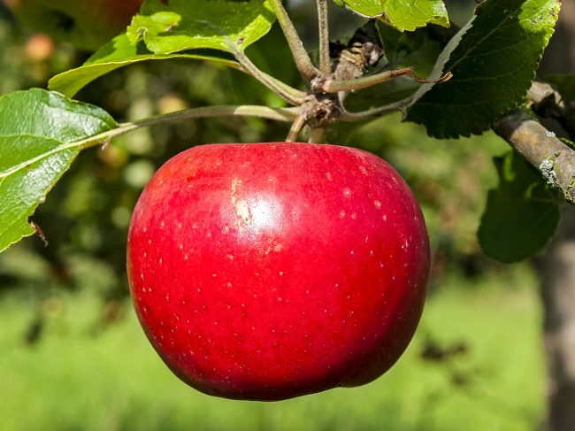

##任务
并学习三个文件夹中的所有.md文件以及视频、ppt。
学习如下视频课程
**[谭平数字图像处理：颜色](https://www.bilibili.com/video/BV1wt411F7LG?p=3)**
**[谭平数字图像处理：图像滤波](https://www.bilibili.com/video/BV1wt411F7LG?p=7)**

##作业
### 1、调试任务
本段代码的⽬的是将这张hello kitty的图⽚的对⽐度增加，但这个代码运⾏起来会报段错误。
作业代码在homework/work1中
**请使用backward或gdb修正错误以实现想要的功能，同时说明错误的地⽅**
提⽰：下⾯这段代码存在两处错误：

``` c++
#include <iostream>
/**
* @file one.cpp
* @brief HITCRT
* @author Cantorxu (1273797180@qq.com)
视觉组竞培营作业代码
* @date 2022-08-07
**/
#include <opencv2/highgui.hpp>
#include <opencv2/opencv.hpp>
int main(void) {
cv::Mat hello = cv::imread("../picture/hello.jpeg");
cv::imshow("
", hello);
int width = hello.size().width;
int height = hello.size().height;
for (int i = 0; i < width; i++) {
for (int j = 0; j < height; j++) {
for (int k = 0; k < 3; k++) {
//
if (hello.at<cv::Vec3i>(i, j)[k] > 200)
hello.at<cv::Vec3i>(i, j)[k] = 255;
else
hello.at<cv::Vec3i>(i, j)[k] = 0;
}
}
}
cv::imshow("
", hello);
cv::waitKey(0);
return 0;
}
```

### 2、OpenCV入门
使用OpenCV入门种文档中介绍的 at()函数直接访问像素值，
1、分别读取作业代码中要求点的像素值，要求以Vec3b的格式输出
2、将原始图片转为灰度图像，再次读取灰度图中要求点的像素值，要求输出成int型
3、将结果保存到output.txt中，与作业代码一起上交。
  

### 3、OpenCV进阶
使用OpenCV进阶中介绍的函数，识别图中的苹果
1、要求使用图像处理的方法，实现图中红色苹果的识别，并绘制圆形轮廓框选识别到的苹果，将框选好的图片保存并与代码一并提交。
2、禁止不识别直接绘制圆框。
  