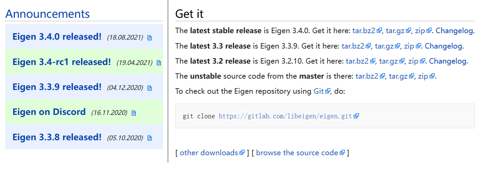

# Eigen库简介

>Eigen is a C++ template library for linear algebra: matrices, vectors, numerical solvers, and related algorithms.
  
Eigen是C++中最常用的矩阵运算库之一，大量用于科学计算、机器人和自动控制等领域，提供了线性代数的基本工具。Eigen大量使用模板等泛型编程的技术，从而具有极高的扩展性，对初次接触C++的人来说，这种代码编写的形式可能非常奇怪，一旦你熟悉之后，会认为这种方式非常的自然和优雅，富有表现力且极其灵活，使用Eigen编写算法就如同在用伪代码一样。  

Eigen通过各种优化手段，获得了极高的运行速度，编写良好的代码速度可以和matlab媲美，甚至可能更快。同时它是跨平台的，支持多种编译器。

Eigen内部的矩阵实现比较复杂，对它的介绍大大超出了本文的范围，因此不作介绍，我们希望你像使用`int`、`double`等内置类型一样自然地使用Eigen的矩阵，而无需关心它的实现方式，这应该是符合其设计初衷的。

Eigen是自由软件（free software），从3.1.1版本开始，它使用MPL2许可。

# 下载与“安装”

#### 下载

Eigen库的官方网站为[https://eigen.tuxfamily.org/](https://eigen.tuxfamily.org/ "Eigen")，可以在官网上下载最新版本和历史版本。



#### “安装”

>In order to use Eigen, you just need to download and extract Eigen's source code (see the wiki for download instructions). In fact, the header files in the Eigen subdirectory are the only files required to compile programs using Eigen. The header files are the same for all platforms. It is not necessary to use CMake or install anything.

事实上，Eigen库仅由头文件组成，因此想要在工程中使用相关内容，只需要在编写代码和编译时包含其头文件即可。

# Eigen库使用

关于Eigen使用的详细信息，请参考[Eigen文档](https://eigen.tuxfamily.org/dox/)，下面对一些常用部分做简要介绍，如有疑问与纰漏，一切以官方文档为准。
*为简便起见，下面所有代码一般省略命名空间Eigen*

## 基本类型

Eigen的基本类型为`Matrix`（矩阵），它是一个模板类，向量只是矩阵的特殊情况。

Matrix类有六个模板参数，但一般只需了解和给出前三个即可。

```cpp
Matrix<typename Scalar, int RowsAtCompileTime, int ColsAtCompileTime>
```

- **Scalar**：元素的类型，它是一种标量类型（scalar type），可以是`double`、`int`等内置类型，也可以是用户自定义的类型或类。使用自定义的类型涉及Eigen的高级话题，详见[使用自定义标量类型](https://eigen.tuxfamily.org/dox/TopicCustomizing_CustomScalar.html#user_defined_scalars)。
- **RowsAtCompileTime**：矩阵的行数
- **ColsAtCompileTime**：矩阵的列数。

例如，如果要创建一个4行3列的矩阵，其元素类型为`double`，可以这样写：

```cpp
Matrix<double,4,3> mat;
```

上述语句创建了名为mat的Matrix对象。

Eigen已经为常用类型提供了重命名，例如：

```cpp
typedef Matrix<double,3,1> Vector3d;
typedef Matrix<int,1,2> RowVector2i;
typedef Matrix<float,4,4> Matrix4f;
typedef Matrix<double,3,3> Matrix3d;
```

## 常用知识

### 初始化对象

`Matrix`的默认构造函数始终可用，但是不执行任何动态内存分配（any dynamic memory allocation），也就是说，以下的代码总是可以的：

```cpp
Matrix3f a;
MatrixXf b;
```

Eigen提供了多种方式完成对实例对象的初始化，例如，在C++11前，对于向量可以使用如下方式：

```cpp
Vector2d a(5.0, 6.0);
Vector3d b(5.0, 6.0, 7.0);
Vector4d c(5.0, 6.0, 7.0, 8.0);
```

在启用了C++11之后，也可用通过列表初始化的方式完成初始化，例如对于列向量，可以用以下方式：

```cpp
Matrix<int, 5, 1> b {1, 2, 3, 4, 5};   // A col-vector containing the elements {1, 2, 3, 4, 5}
```

对于一般的矩阵，则需要每一行都作为初始化器列表的初始化器列表传递，例如：

```cpp
MatrixXi a {      // construct a 2x2 matrix
      {1, 2},     // first row
      {3, 4}      // second row
};
Matrix<double, 2, 3> b {
      {2, 3, 4},
      {5, 6, 7},
};
```

### 元素操作

#### 单个元素索引与赋值

与matlab语法相似，对单个元素赋值和修改可以使用（）操作符，例如

```cpp
Martix<double,4,4> mat;
mat(2,2)=4.0;
```

对于行或列向量，还可以以类似一维数组的方式访问，例如：

```cpp
VectorXd v(2);
v(0) = 4;
v(1) = v(0) - 1;
```

#### Comma-initialization

还可以使用所谓的逗号初始化器（comma-initializer）进行元素值的设置，例如：

```cpp
Matrix<int,3,3> m;
m << 1, 2, 3,
     4, 5, 6,
     7, 8, 9;
```

Tips：值得注意的是，Eigen为`Matrix`重载了多种<<操作符，可以很方便的实现各种操作，例如标准输出流操作：

```cpp
Matrix<int,2,2> m {
    {1, 2},
    {3, 4},
};
std::cout << "m: " << m << std::endl;
```

#### 块操作

Eigen中最常见的块操作通过使用`block`成员函数来实现，它有两个版本，引用官方的说明：

|Block operation|Version constructing a dynamic-size block expression|Version constructing a fixed-size block expression|
| ----  | ----  |  ---- |
|Block of size `(p,q)`, starting at `(i,j)`|`matrix.block(i,j,p,q);`|`matrix.block<p,q>(i,j);`|

实际上这两种方式都可以用于固定大小和动态大小的矩阵，在语义上是等价的。它们唯一的区别在于如果操作的块比较小，用后一种方式通常能得到更快的代码。


### 矩阵与向量计算

#### 初等运算

Eigen通过运算符重载实现了大量基础运算。
对于两个矩阵相加、减、乘，可以很自然的写成如下的形式：

```cpp
Matrix2d a;
a << 1, 2,
     3, 4;
Matrix2d b(2,2);
b << 2, 3,
     1, 4;
double scalar = 0.6;
auto add = a + b;
auto sub = a - b;
auto mat_times_scalar = scalar * a;
auto mat_times_mat = a * b;
```

#### 转置、共轭、伴随、求逆

矩阵$A$的转置矩阵$A^T$、共轭矩阵$\overline A$、伴随矩阵$A^*$和逆矩阵$A^{-1}$可以分别利用成员函数`transpose()`、 `conjugate()`、`adjoint()`和`inverse()`求得，例：

```cpp
MatrixXcf A = MatrixXcf::Random(2,2);
cout << "Here is the matrix A\n" << a << endl;
 
cout << "Here is the matrix A^T\n" << a.transpose() << endl;
 
 
cout << "Here is the conjugate of A\n" << a.conjugate() << endl;
 
 
cout << "Here is the matrix A^*\n" << a.adjoint() << endl;

cout << "Here is the matrix A^-1\n" << a.inverse() << endl;
```

值得注意的是，这里的伴随是单词*adjoint*的直译，矩阵的伴随（adjoint of matrix）在不同语境下有不同的定义，需要仔细甄别，在这里，指的是矩阵的共轭转置（conjugate transpose）。

#### 生成特殊矩阵

在Eigen中，`Matrix`类提供了一些静态方法用以生成一些特殊矩阵，例如`Zero()`用于生成零矩阵，`Identity()`能够生成单位矩阵,`Random()`能够生成随机矩阵等。同时，也提供了一些非静态成员方法来实现同样的功能，如`setZero()`、`setIdentity()`。  
例：

```cpp
const int size = 6;
MatrixXd mat1(size, size);
mat1.topLeftCorner(size/2, size/2)     = MatrixXd::Zero(size/2, size/2);
mat1.topRightCorner(size/2, size/2)    = MatrixXd::Identity(size/2, size/2);
mat1.bottomLeftCorner(size/2, size/2)  = MatrixXd::Identity(size/2, size/2);
mat1.bottomRightCorner(size/2, size/2) = MatrixXd::Zero(size/2, size/2);
std::cout << mat1 << std::endl << std::endl;
 
MatrixXd mat2(size, size);
mat2.topLeftCorner(size/2, size/2).setZero();
mat2.topRightCorner(size/2, size/2).setIdentity();
mat2.bottomLeftCorner(size/2, size/2).setIdentity();
mat2.bottomRightCorner(size/2, size/2).setZero();
std::cout << mat2 << std::endl << std::endl;
 
MatrixXd mat3(size, size);
mat3 << MatrixXd::Zero(size/2, size/2), MatrixXd::Identity(size/2, size/2),
        MatrixXd::Identity(size/2, size/2), MatrixXd::Zero(size/2, size/2);
std::cout << mat3 << std::endl;
```


#### 点乘与叉乘

对于向量，还定义考虑点乘运算和叉乘运算，通过成员函数
`dot()`和`cross()`完成。
例：

```cpp
Eigen::Vector3d v(1,2,3);
Eigen::Vector3d w(0,1,2);

std::cout << "Dot product: " << v.dot(w)<< std::endl;
std::cout << "Cross product:\n" << v.cross(w) << std::endl;
```

#### 操作合法性检查

矩阵之间的各种运算均有其严格的数学定义和要求，例如矩阵的加减法，要求两个矩阵的行数和列数相同。对于不合法的操作，Eigen通常会在编译时报错，遗憾的是，由于使用C++模板元编程，这种报错信息通常非常长且难以阅读，但好在Eigen考虑到了这一点，会在报错中用大写字母对关键问题进行强调突出（UPPERCASE_LETTERS_SO_IT_STANDS_OUT）。例如，对于下列代码

```cpp
Matrix3f m;
Mttrix4f v;
v = m+v; 
```

将会给出编译错误：YOU_MIXED_MATRICES_OF_DIFFERENT_SIZES。因此，当Eigen出现问题时，可以直接找到大写的部分，推测出了什么问题。    

对于动态矩阵，由于无法在编译时确定其维度，因此在编译i时不会报错i，但在运行时会执行断言，如果出现问题，在“debug mode”下会给出提示信息，并终止程序。

**需要强调的是，出于性能的考虑，Eigen并不支持自动类型提升，因此下列的代码是不合法的：**

```cpp
Matrix4d a;
Matrix4f b;
a+b;
```

**虽然在C++中，将一个`double`类型的变量和`float`类型的变量是允许的，编译器会自动执行隐式类型转换，但在Eigen中必须显式地完成，否则就会报错。**


**<font size=5>关于更多有关Eigen的细节和使用方式，请阅读官方文档，事实上，本文所涵盖的内容只是Eigen的冰山一角。在实际中，秉承效率至上的原则，没必要对一个大型库的所有细节都了如执掌（虽然并没有坏处，但费时费力），遇到需要的东西时，去查文档就好了。</font>**


