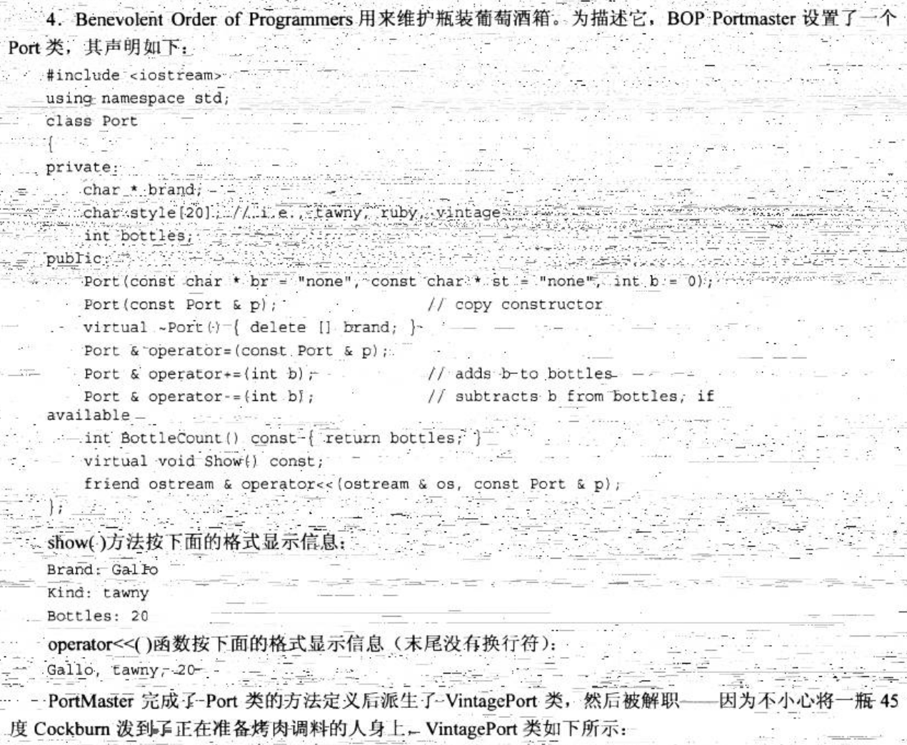
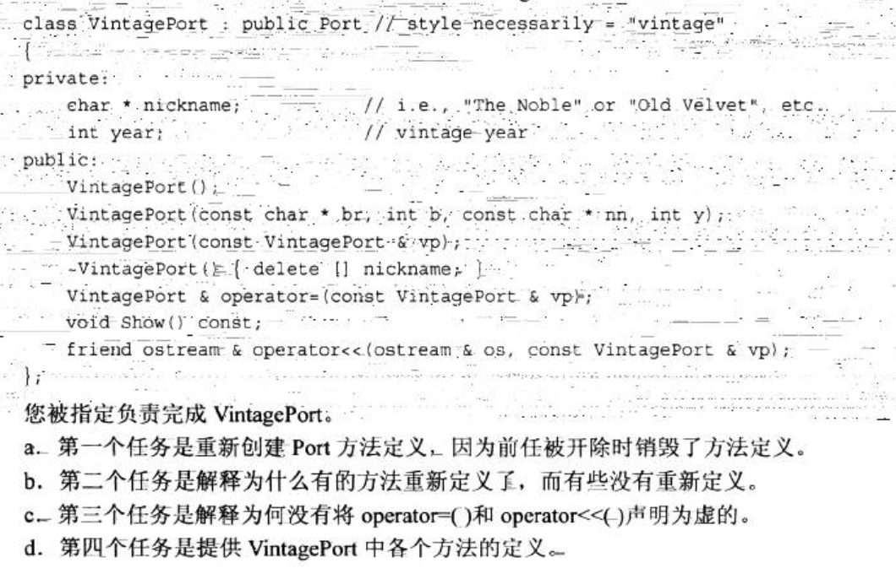

# 任务

- 学习一些数据处理的常用算法，阅读相关文档
- 学习有关PCL和Eigen的内容，阅读相关文档
- 学习黑马C++有关类的继承和多态以及文件操作的相关内容
- 完成相关练习

# 作业

一、对附带的`PCD`文件（cylinder.pcd）进行读取、滤波、圆柱拟合操作并将得到的圆柱轴线信息、半径信息保存到`cylinder.txt`(自行创建)中，把最终用来圆柱拟合的点云保存为`PCD`文件

   > 滤波操作可能不需要，可能需要多种滤波共同作用，请都尝试一下观察效果，并写成总结的形式以`markdown`文件或`txt`文件保存。

二、看卡尔曼滤波部分文档及链接中的内容（可以有挑选地看），理解卡尔曼滤波的原理，可能在后续大作业中会有具体应用。

三、对附带的数据（data_no3.txt），(1)用一种插值方法得到多项式函数 (2)用最小二乘法得到多项式函数，将结果输出到`txt`文件中。（如果有空可以画成图像方便观察.（`opencv`））

四、首先随机生成一个大的Eigen矩阵A，把它左上角的3$\times$3的块中的所有元素赋值为0，同时把右下角的5$\times$5的块变为单位阵，最终矩阵为A'。再生成另一个同样大小的矩阵B，用1到n（n为B的元素个数）填充B，与A'的转置做乘法，得到C，输出C的中的最大值，并求C的行列式值。请编程实现。

五、完成《C++ Primer Plus》中的练习题：

请编写一个程序演示你的工作。

编写一个简单的文本处理程序，它对两个文本文件进行比较，找出其中相同的所有单词，并输出到另一个文本文件中，并用空格分隔开。

---

**注意：第六题或第七题请至少完成一道（若实在觉得完成难度太大，也请尝试一下），若时间允许，鼓励全部完成，以增加对Eigen的熟练程度，同时感受一下在没有现成代码的情况下手写实际的数值算法。**

六、（选做）考虑简单无约束的最小二乘问题，通常为以下的形式：

$$\begin{split}\min_{\mathbf{x}} \quad \frac{1}{2}\sum_{i} \left(\left\|f_i\left(x_{i_1}, ... ,x_{i_k}\right)\right\|^2\right)\end{split}$$

使用向量，改写为更紧凑的形式：

$$\min_{\mathbf{x}} \quad F(\mathbf x)=\frac{1}{2} \left(\left\|\pmb{f}(\mathbf{x})\right\|^2\right) $$

这里的$\left\| \cdot \right\|$指2-范数（注：向量的2-范数定义为$\left\| \mathbf{x} \right\|= \sqrt{\sum_{i} {x_i^2}}$，即所有元素平方和的平方根）。

求解该问题的一个常用方法为高斯牛顿法（Gauss-Newton），它是一种迭代算法，因此需要给定一个初值（需要适当选取，否则可能迭代到局部极小值甚至不收敛）用于迭代的开始，具体步骤如下（证明略）：

1. 给定初值$\pmb{x}_0$
2. 对于第k次迭代，求出当前的雅可比矩阵$\pmb J_k$和$\pmb f(\pmb{x}_k)$
3. 求解增量方程$\pmb H\Delta\pmb{x}_k=\pmb g$，其中$\pmb H=\pmb{J}_k^T\pmb{J}_k,\ g=-\pmb{J}_k^T\pmb{f}(\pmb{x}_k)$
4. 如果$\Delta{\pmb{x}}_k$很小（例如小于1e-5），则停止迭代，否则令$\pmb x_{k+1}=\pmb x_k+\Delta{\pmb x_k}$，重复第二步    
    
了解了上述算法后，请针对给出的数据(data_no6.txt)，完成曲线拟合的任务，即求解下列的最小二乘问题：

$$\min_{a,b,c,d} \quad \frac{1}{2} \left(\left\| y_i-(e^{ax_i^2+bx_i+c}+dx_i) \right\|^2\right)$$

真实解为$a=0.1,\ b=0.2,\ c=0.3,\ d=4$，由于数据误差等问题，得到的解的值接近即可（注意初值的选取，一般取在真实解附近稍远一点即可）。

七、（选做）学习Eigen的几何模块，完成以下的问题：机器人萝卜发现在她的视野内有一个奇怪的飞行物在空中一直处于静止状态，此时在萝卜自身的坐标系下，该物体的坐标为(1,2,3)，为了更好观察它，萝卜做了一些机动，由于萝卜是个**高性能机器人**，她可以在三维空间自由运动，她首先按zyx的顺序分别转动了$30^\circ,\ 40^\circ,\ 50^\circ$，随后，她又向自己的正前方（即x轴方向）移动了1个单位距离，之后又以xyz的顺序分别转动了$-60^\circ,\ 20^\circ,\ -50^\circ$，求此时在萝卜的视野中，那个奇怪的飞行物的坐标是多少？【注：由于萝卜是**高性能机器人**，不用担心视野大小的问题，同时，题目中的“更好”是指萝卜认为是“更好”的，而不是通常意义上的“更近”（那大概是你认为的）或者其他什么】

